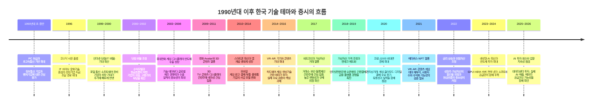
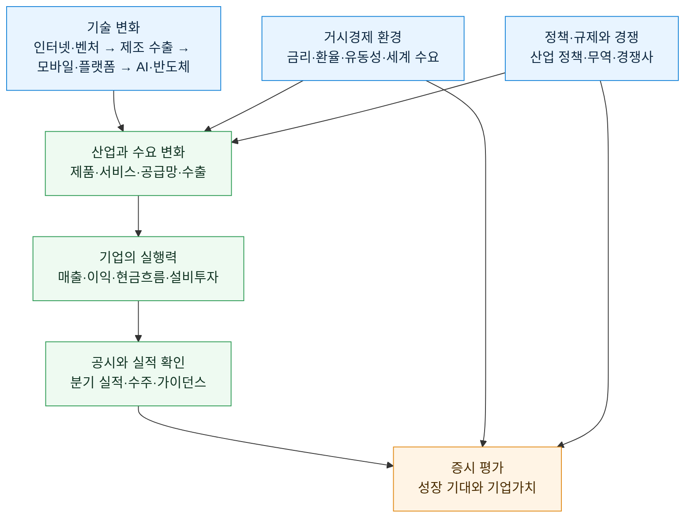
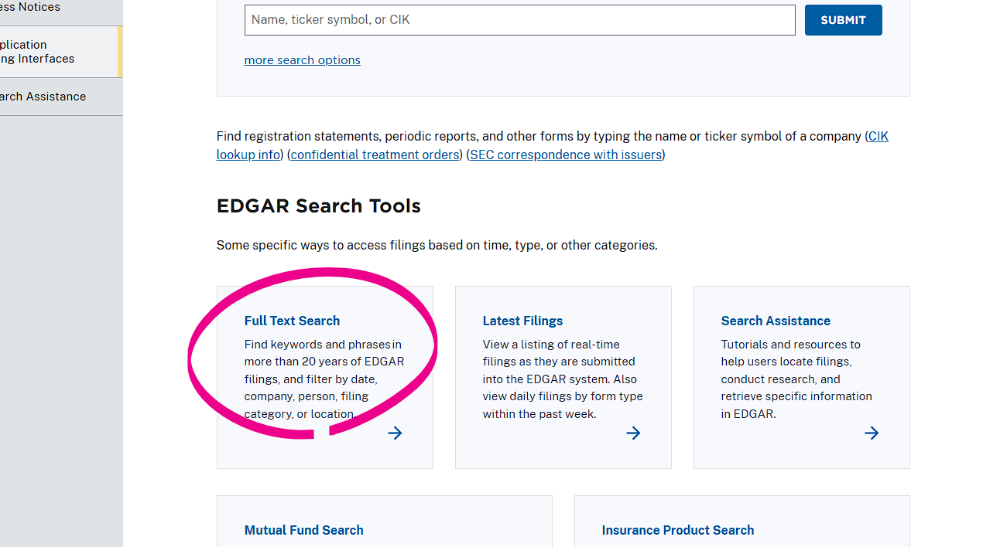
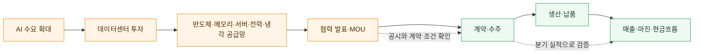

# 주식 1

주식 1에서는 경제 순환, 산업 구조, 기업 공시를 연결해 살펴봅니다. **산업**은 비슷한 제품·서비스를 제공하며 경쟁하거나 협력하는 기업들의 집합입니다.

## 경제 순환과 산업 분석의 연결

경기 국면, 물가·금리·환율 같은 거시경제의 기본 구조는 [거시경제와 주식시장 읽기](11.md)에서 한곳에 정리합니다. 이 문서에서는 그 변화가 **산업의 수요·비용·경쟁과 개별 기업의 실적**에 어떻게 이어지는지에 집중합니다. 경기 국면의 순서·기간·강도는 매번 다르므로, 한 건의 뉴스나 한 개의 지표만으로 방향을 단정해서는 안 됩니다.

## 산업 구조와 경쟁 환경

기업을 평가할 때는 개별 회사뿐 아니라 그 회사가 속한 산업의 경쟁 구조를 함께 분석해야 합니다.

- **새 회사가 쉽게 들어올 수 있나?**
- **비슷한 물건으로 바꿀 수 있나?**
- **손님이 가격을 깎자고 할 힘이 큰가?**
- **재료를 파는 쪽의 힘이 큰가?**
- **같은 일을 하는 회사끼리 경쟁이 심한가?**

이 다섯 가지 질문은 산업이 얼마나 힘든지 생각하는 데 도움이 됩니다.

### 국내 대표 5개 섹터에 적용해 보기

아래는 국내 상장사의 대표 사례를 통해 다섯 가지 질문을 연습해 보는 표입니다. 각 회사가 반드시 좋은 투자 대상이라는 뜻은 아니며, 실제 판단에서는 공시·실적·가격을 함께 확인해야 합니다.

| 섹터·대표 기업 | 신규 진입·대체재 | 고객·공급자 힘 | 기존 경쟁과 읽어 볼 점 |
| --- | --- | --- | --- |
| 반도체 · **삼성전자** | 첨단 공정·대규모 설비투자가 필요해 신규 진입 장벽이 높습니다. 다만 메모리와 파운드리에서는 기술 변화와 해외 경쟁사가 대체 압력을 만듭니다. | 대형 IT 기업이 많은 물량을 사면 가격 협상력이 커질 수 있습니다. 장비·소재·설계 IP 공급망도 중요합니다. | 글로벌 메모리 가격, AI용 고부가 제품 비중, 설비투자와 재고 흐름을 함께 봅니다. |
| 자동차 · **현대차** | 완성차 생산망·브랜드·판매망이 장벽이지만, 전기차 전환과 중국·신생 전기차 브랜드는 경쟁을 높입니다. | 소비자는 차종과 가격을 비교할 수 있고, 배터리·반도체·철강 공급 차질은 원가에 영향을 줍니다. | 판매량뿐 아니라 평균판매가격(ASP), 환율, 전기차·하이브리드 제품 구성, 지역별 경쟁을 봅니다. |
| 2차전지 · **LG에너지솔루션** | 공장 투자와 고객 인증이 필요해 진입이 쉽지 않지만, 중국 배터리 기업과 새로운 배터리 기술이 경쟁 요인입니다. | 완성차 고객은 대형 구매자라 계약·가격 협상력이 큽니다. 리튬·니켈 등 원재료 가격과 공급 계약도 중요합니다. | 수주잔고만 보지 말고 가동률, 원재료 연동 구조, 고객 다변화와 설비투자 회수 기간을 확인합니다. |
| 인터넷 플랫폼 · **NAVER** | 서비스를 만드는 일은 비교적 쉬워도 이용자 수, 데이터, 브랜드, 생태계를 쌓기는 어렵습니다. AI 검색·숏폼·해외 플랫폼은 대체재가 될 수 있습니다. | 이용자는 다른 앱으로 이동하기 쉽고, 광고주·판매자는 트래픽과 수수료를 비교합니다. | 검색·광고·커머스·콘텐츠별 성장률과 규제, AI 서비스의 수익화, 이용자 체류시간을 나눠 봅니다. |
| 금융 · **KB금융** | 인가·자본·신뢰가 필요해 신규 은행 진입 장벽은 높습니다. 핀테크, 증권·보험, 인터넷전문은행은 일부 업무의 대체 경쟁자입니다. | 예금 고객은 금리와 편의성을 비교하고, 자금 조달 비용은 시장금리와 예금 경쟁의 영향을 받습니다. | 금리뿐 아니라 대손비용, 연체율, 자본비율, 배당·자사주 정책을 함께 확인합니다. |

같은 다섯 질문을 써도 섹터마다 답이 다릅니다. 반도체·2차전지는 공급망과 설비투자, 자동차는 제품 전환과 지역별 판매, 플랫폼은 이용자·광고주, 금융은 신용 위험과 자본 규제가 핵심이 되기 쉽습니다. 그래서 한 회사의 PER·주가만 보기보다 그 회사가 어떤 경쟁 구조 안에서 이익을 내는지를 먼저 생각하는 습관이 필요합니다.

- **PER(Price Earnings Ratio, 주가수익비율)**: 회사 이익과 주가를 비교합니다.
- **PBR(Price to Book Ratio, 주가순자산비율)**: 회사가 가진 순재산과 주가를 비교합니다.

## 기업의 공식 정보: 공시

회사는 투자 판단에 중요한 사실을 **공시**로 알립니다. 우리나라에서는 **DART(Data Analysis, Retrieval and Transfer System, 전자공시시스템)**에서 사업보고서, 대규모 계약, 신주 발행 등을 확인할 수 있습니다.

- 새 주식을 많이 만들면 기존 주주의 몫이 작아질 수 있습니다.
- 회사가 자기 주식을 사들이면 시장에 나온 주식 수가 줄 수 있습니다.
- 좋은 소식도 나쁜 소식도 원문과 날짜를 함께 봅니다.

## 산업을 비교하는 방법

| 살펴볼 것 | 쉬운 질문 |
| --- | --- |
| 제품 | 사람들은 왜 이 물건을 살까요? |
| 경쟁 | 다른 회사가 쉽게 따라 할 수 있습니까? |
| 손님 | 손님이 계속 늘고 있습니까? |
| 비용 | 재료값이나 전기값이 크게 오르나요? |
| 위험 | 법, 날씨, 전쟁, 환율 같은 일이 영향을 주나요? |

## 주도주·대장주: 대표라는 말과 시장을 이끄는 말은 달라요

**대장주**는 특정 산업이나 테마에서 규모·거래량·관심이 큰 대표 종목을 가볍게 부르는 말이에요. 반면 **주도주**는 일정 기간 실제 주가 흐름과 시장 관심을 이끌어, 지수나 업종의 방향에 큰 영향을 주는 종목 또는 업종을 말합니다. 대장주가 주도주인 경우가 많지만, 둘은 같은 말이 아니에요.

| 표현 | 보통 쓰는 뜻 | 확인할 점 |
| --- | --- | --- |
| 주도주 | 상승장이나 특정 국면에서 시장·업종 수익률을 이끄는 종목 또는 업종이에요. | 주가뿐 아니라 실적 추정치, 거래대금, 업종 내 동반 상승이 있는지 봐요. 시장 상황이 바뀌면 주도주도 바뀔 수 있어요. |
| 대장주 | 해당 산업·테마를 대표한다고 인식되는 규모·유동성·관심이 큰 종목이에요. | 대표성은 매출, 시가총액, 기술력, 거래량 등 여러 기준에 따라 달라져요. ‘대장’이라는 별명이 실적 우위를 보장하지는 않아요. |
| 후발주·추종주 | 대장주나 주도주의 움직임 뒤에 함께 관심을 받는 종목을 말해요. | 같은 테마로 묶여도 매출 연결성, 재무 상태, 유동성은 크게 다를 수 있어요. |
| 테마주 | 정책·뉴스·유행과 연결된다는 기대 때문에 함께 움직인다고 여겨지는 종목이에요. | 실제 사업보다 기대와 소문이 가격을 움직일 수 있으므로, ‘대장주’라는 말만으로 매수 근거를 만들면 안 돼요. |

주도주를 찾는다는 것은 가장 많이 오른 종목을 뒤쫓는 것과 다릅니다. **왜 이익 전망이 좋아졌는지**, **그 변화가 한 회사만의 일인지 산업 전체의 수요 변화인지**, **이미 주가에 기대가 얼마나 반영됐는지**를 나누어 봐야 해요. 특히 거래량 급증이나 뉴스 한 건만으로 ‘새 대장주’라고 단정하지 말고, 공시·실적·수주·고객·현금흐름을 확인하세요.

## 핵심 정리

유행하는 산업이라고 모든 회사가 잘되는 것은 아니에요. 내가 이해할 수 있는 회사와 산업을 천천히 살펴보는 것이 좋습니다.

## 경제 뉴스는 이렇게 읽습니다

경제 뉴스에는 금리, 물가, 환율, 수출 같은 말이 자주 나옵니다. 이 말들은 서로 연결되어 있습니다.

- **금리**가 오르면 돈을 빌리는 일이 부담스러워져서, 회사와 사람 모두 지출을 줄일 수 있습니다.
- **물가**가 너무 빨리 오르면 같은 돈으로 살 수 있는 것이 줄어듭니다.
- **환율**이 오르면 달러를 사는 데 더 많은 원화가 필요합니다. 수입 재료를 많이 쓰는 회사는 비용이 늘 수 있고, 수출 회사에는 도움이 될 수도 있습니다.
- **수출**은 우리나라 물건을 다른 나라에 파는 일입니다. 수출이 늘어도 모든 회사가 똑같이 좋아지는 것은 아니에요.

숫자는 하나씩 보지 말고 ‘왜 바뀌었을까?’를 함께 생각해 보세요.

<button type="button" class="macro-news-simulator-button" data-macro-news-simulator><i class="fa-solid fa-sliders"></i> 경제 뉴스 미니 시뮬레이션 열기</button>

## 세계 경제에서 한국이 차지하는 위치

한국은 인구와 국토 규모만으로는 대국에 속하지 않지만, 무역과 제조업의 비중이 큰 **개방형 선진 경제**입니다. IMF는 한국을 선진경제(advanced economy)로 분류합니다. 한국 경제는 국내 소비만으로 움직이기보다 해외 수요, 환율, 원자재 가격, 세계 금리와 밀접하게 연결됩니다.

2024년 한국의 상품 수출은 약 **6,838억 달러**로 역대 최고치를 기록했습니다. 산업통상자원부는 WTO 통계를 기준으로 2024년 1~9월 누적 수출 순위가 세계 6위였다고 설명했습니다. 순위는 집계 기간·상품/서비스 포함 여부·환율에 따라 달라질 수 있으므로, 특정 순위 자체보다 한국이 세계 교역에서 큰 비중을 가진 수출국이라는 점을 이해하는 것이 중요합니다.

| 관점 | 한국 경제의 특징 | 주식·경제 뉴스에서 확인할 점 |
| --- | --- | --- |
| 수출 | 반도체, 자동차, 선박, 석유제품, 기계, 배터리 소재 등 제조업 수출의 비중이 큽니다. | 세계 경기, 해외 주문, 주요 수출 품목의 가격·물량이 기업 실적에 미치는 영향을 확인합니다. |
| 공급망 | 미국·중국·유럽·일본·대만 등과 부품·장비·기술·판매망이 연결되어 있습니다. | 관세, 수출 통제, 물류 차질, 특정 국가의 경기 변화가 어느 업종에 영향을 주는지 구분합니다. |
| 에너지·원자재 | 원유·가스·광물 등 많은 원자재를 해외에서 들여옵니다. | 유가와 원자재 가격 상승은 수입 비용과 물가를 높일 수 있으며, 업종별 영향은 다릅니다. |
| 금융시장 | 원화는 달러, 미국 금리, 외국인 자금 흐름에 영향을 받습니다. | 환율 변화가 수출 기업의 원화 매출, 수입 기업의 비용, 외국인 투자자의 수익률에 어떻게 연결되는지 봅니다. |
| 기술 경쟁력 | 메모리 반도체, 디스플레이, 조선, 자동차 등에서 세계 공급망에 중요한 기업이 있습니다. | 한 산업의 호황이 한국 전체 경제를 대표한다고 단정하지 말고, 품목·기업별 경쟁력과 수요를 따로 확인합니다. |

### 한국 경제를 볼 때 함께 생각할 강점과 과제

한국의 강점은 높은 제조 역량, 빠른 기술 상용화, 세계 시장에 진출한 기업들입니다. 반면 수출 비중이 높기 때문에 세계 경기 둔화나 교역 갈등의 영향을 크게 받을 수 있습니다. 특정 품목, 특히 반도체의 경기 변동이 수출·설비투자·증시에 크게 전달되는 점도 특징입니다.

또한 에너지·원자재 수입 의존, 저출생·고령화에 따른 인구 구조 변화, 가계와 기업의 이자 부담, 지정학적 위험은 장기적으로 점검해야 할 과제입니다. 이런 과제는 한국 경제가 약하다는 뜻이 아니라, 경제 뉴스를 읽을 때 성장 요인과 위험 요인을 함께 보아야 한다는 의미입니다.

### 투자자가 연결해 보는 질문

1. 세계 수요 변화가 한국의 어떤 수출 품목과 기업에 먼저 영향을 줄 수 있는가?
2. 원/달러 환율 변화는 매출·원가·외국인 자금 흐름에 각각 어떤 영향을 주는가?
3. 미국·중국의 정책 변화가 한국 기업의 고객, 공급망, 경쟁사에 어떤 변화를 만드는가?
4. 수출 증가가 물량 증가인지, 가격 상승 때문인지, 특정 품목만의 변화인지 구분했는가?

> 더 쉽게 보는 참고 자료: [한국무역협회 K-stat 무역통계](https://stat.kita.net/)에서 연도별·품목별 수출입을 확인하고, [World Bank WITS 한국 무역 요약](https://wits.worldbank.org/countrysnapshot/en/KOR/textview)에서 한국의 수출·수입·무역수지와 품목별 현황을 텍스트로 볼 수 있습니다. 한국이 선진경제로 분류되는 기준과 국가 목록은 [IMF WEO 국가 분류 안내](https://www.imf.org/en/publications/weo/weo-database/2024/april/groups-and-aggregates)에서 확인합니다. 수출액·순위·경제 전망은 발표 시점과 통계 기준에 따라 바뀔 수 있습니다.

## 기술 변화와 한국 증시: 1990년대 이후 연대기

한국 증시는 새로운 기술이 등장할 때마다 관련 기업의 성장 가능성을 먼저 평가해 왔습니다. 다만 기술이 주가를 자동으로 올리는 것은 아닙니다. 기대가 빠르게 커진 뒤 실제 매출·이익·현금흐름이 따라오지 못하면 주가가 크게 조정될 수 있습니다. 아래 연대기는 기술 변화, 산업 구조, 투자 심리가 어떻게 연결되었는지 이해하기 위한 학습용 정리입니다.

### 한눈에 보는 기술 테마와 거시경제의 연결

아래 인포그래픽은 앞의 연대기를 바탕으로 기술 변화, 금리·환율·유동성, 기업 실적과 공시가 어떻게 이어지는지 한 화면에 정리한 자료입니다. 기술 테마가 화제가 되더라도 실제 투자 판단에서는 글로벌 수요, 금리와 환율, 기업의 매출·이익·설비투자를 차례로 확인해야 합니다.

*그림을 읽을 때에는 화살표를 인과관계로 단정하지 말고, 각 단계의 공시·실적·거시 지표로 실제 연결 여부를 확인합니다.*

### 시기별로 무엇이 달랐는가

| 시기 | 기술·산업의 핵심 변화 | 증시에서 나타난 관심 | 학습할 점 |
| --- | --- | --- | --- |
| 1990년대 후반~2000년대 초 | 인터넷 보급과 벤처 투자 확대 | 인터넷·통신·소프트웨어 기업의 성장 기대 | 이용자 수나 기술 화제만으로는 기업가치를 판단할 수 없으며, 수익모델과 재무 안전성을 확인해야 합니다. |
| 2000년대 중후반 | 휴대전화, 게임, 디스플레이, 메모리 반도체의 수출 확대 | 제조 경쟁력과 세계 시장 점유율 | 기술은 제품 경쟁력·원가·해외 고객·환율과 결합될 때 기업 실적으로 이어집니다. |
| 2009~2016년 | 3D·스마트폰·앱·VR/AR 등 사용자 경험 중심 기술의 등장 | 콘텐츠, 모바일 플랫폼, 부품, 게임 테마 | 신기술은 기대가 앞서기 쉽습니다. 실제 기기 판매, 서비스 이용자, 반복 매출을 따로 확인해야 합니다. |
| 2017~2022년 | 가상자산, 핀테크, 메타버스와 디지털 플랫폼의 성장 | 거래소·보안·결제·블록체인·콘텐츠 관련주 | 24시간 거래, 규제 변화, 금리와 유동성은 위험자산 가격에 큰 영향을 줄 수 있습니다. |
| 2023년 이후 | 생성형 AI와 대규모 데이터센터 투자 | AI 반도체, 메모리, 장비·소재, 서버·전력·냉각, 소프트웨어 | AI 기대는 공급망 전체에 고르게 배분되지 않습니다. 고객의 설비투자와 공급사의 실제 매출·마진·재고를 함께 봐야 합니다. |

### 기술 테마를 읽는 공통 원칙

1. **기술의 화제성과 기업의 수익성은 구분합니다.** 새로운 서비스가 주목받아도 누가 돈을 벌고 언제 현금흐름이 생기는지는 별도 문제입니다.
2. **공급망을 나누어 봅니다.** 플랫폼, 콘텐츠, 부품, 장비, 소재, 전력처럼 같은 기술 안에서도 수혜를 받는 방식이 다릅니다.
3. **금리와 유동성을 확인합니다.** 먼 미래의 성장을 기대하는 기업일수록 금리 변화와 투자 심리에 민감할 수 있습니다.
4. **정책과 규제를 확인합니다.** 가상자산·개인정보·플랫폼·AI는 법과 제도의 변화가 사업 모델에 직접 영향을 줄 수 있습니다.
5. **테마 이름보다 공시와 실적을 우선합니다.** 계약 규모, 고객, 매출 인식 시점, 투자 비용, 재고와 부채를 원문 자료에서 확인해야 합니다.

> 관련 제도를 확인할 때는 [한국거래소의 ‘코스닥시장이란?’ 안내](https://open.krx.co.kr/contents/OPN/01/01010201/OPN01010201.jsp)에서 코스닥이 기술·벤처기업 중심 시장으로 만들어진 배경을, [금융위원회의 토스뱅크 은행업 인가 자료](https://fsc.go.kr/no010101/76050?curPage=4&srchBeginDt=&srchCtgry=&srchEndDt=&srchKey=&srchText=)에서 인터넷전문은행의 출범 경과를 확인할 수 있습니다. 여러 금융회사의 계좌를 한 곳에서 조회·이체·관리하는 오픈뱅킹의 기능은 [금융위원회 오픈뱅킹 안내](https://www.fsc.go.kr/no040101?cnId=2802&curPage=54&pastPage=52&srchKey=&srchText=)를 참고하세요. 가상자산 가격은 매우 크게 흔들릴 수 있으며, 한국 거래소에서 비트코인 가격이 해외보다 높게 형성되는 이른바 ‘김치 프리미엄’ 사례는 [IMF FinTech Note의 한국 설명](https://www.elibrary.imf.org/view/journals/063/2022/005/article-A001-en.xml)에서 직접 언급합니다.

## 시황·공시를 확인하는 외부 자료

방송과 뉴스는 시장의 쟁점을 빠르게 파악하는 데 유용하지만, 매수·매도 판단의 근거가 될 수는 없습니다. 방송에서 언급한 기업·계약·정책은 반드시 공시와 원문 자료로 다시 확인합니다. 아래 링크는 학습 화면에서 별도 창으로 열립니다.

### 국내 경제·증권 방송

- [한국경제TV](https://www.wowtv.co.kr/): 국내외 증시·산업·경제 이슈를 다루는 경제 전문 방송입니다.
- [매일경제TV](https://www.mktv.co.kr/): 경제·증권 방송과 시황 정보를 제공합니다.
- [서울경제TV SEN](https://www.sentv.co.kr/): 국내 증시와 산업 이슈를 다룹니다.
- [이데일리TV](https://tv.edaily.co.kr/): 금융·산업·정책 뉴스를 영상으로 확인할 수 있습니다.
- [MTN 머니투데이방송](https://www.mtn.co.kr/): 국내외 시장과 기업 이슈를 다룹니다.
- [토마토증권통](https://www.tomato-tong.com/): 국내 증시 시황과 투자 교육 콘텐츠를 제공합니다.
- [SBS Biz](https://biz.sbs.co.kr/): 경제·산업 뉴스와 시황 프로그램을 제공합니다.

IPTV 채널 번호와 편성은 통신사·상품·지역에 따라 달라질 수 있으므로, 채널명과 공식 편성표를 함께 확인합니다.

### 해외 시장·세계 경제 뉴스

- [Bloomberg Television](https://www.bloomberg.com/live): 세계 증시, 금리, 환율, 원자재, 기업 뉴스를 확인할 수 있습니다.
- [CNBC Markets](https://www.cnbc.com/markets/): 미국 시장의 개장·마감과 기업 실적 보도를 참고할 수 있습니다.
- [Reuters Markets](https://www.reuters.com/markets/): 통신사 기사로 세계 시장과 주요 경제 뉴스를 비교할 수 있습니다.
- [Yahoo Finance](https://finance.yahoo.com/): 미국 종목의 시세, 실적 일정, 기본 지표를 찾아볼 수 있습니다.

### 투자 판단의 우선순위: 공식 원문

- [DART 전자공시](https://dart.fss.or.kr/): 사업보고서, 실적, 유상증자, 감사 의견 등 국내 기업의 공시 원문을 확인합니다.
- [KIND 한국거래소 공시](https://kind.krx.co.kr/): 상장회사 공시와 시장 정보를 확인합니다.
- [한국거래소(KRX)](https://www.krx.co.kr/): 시장 제도, 지수, 상장·공시 관련 공식 정보를 제공합니다.
- [금융감독원(FSS)](https://www.fss.or.kr/): 금융소비자 정보와 제도 안내를 확인합니다.

## 산업의 생애주기

산업은 도입·성장·성숙·쇠퇴에 가까운 단계를 거치는 경우가 많습니다. 수요가 빠르게 늘면 경쟁 기업도 증가하고, 시간이 지나면 시장 성장률이 낮아지거나 대체 기술이 등장할 수 있습니다.

| 산업의 모습 | 쉬운 질문 |
| --- | --- |
| 시작 | 새 물건을 누가 처음 쓰고 있습니까? |
| 성장 | 손님과 매출이 빠르게 늘고 있습니까? |
| 안정 | 큰 회사들이 자리를 잡았나요? |
| 변화 | 다른 기술이나 물건이 대신하고 있습니까? |

반도체, 자동차, 게임, 음식처럼 서로 다른 산업은 자라는 속도와 위험이 다릅니다. 그래서 ‘인기 산업’이라는 말보다 실제 손님·경쟁·비용을 확인하는 편이 좋습니다.

## 반도체 산업을 볼 때

반도체는 휴대전화, 자동차, 컴퓨터, 서버에 들어가는 중요한 부품입니다. 하지만 반도체 회사의 실적은 오르내림이 큰 편입니다. 물건이 부족할 때는 가격이 오르다가, 회사들이 너무 많이 만들면 가격이 내려갈 수 있습니다.

반도체 뉴스를 볼 때는 다음을 차례로 살펴보세요.

1. 사람들이 휴대전화·컴퓨터·**AI(Artificial Intelligence, 인공지능)** 서버를 더 많이 사고 있습니까?
2. 회사들이 공장과 장비에 돈을 얼마나 쓰고 있습니까?
3. 재고가 쌓이고 있지는 않나요?
4. 한 회사만 좋은지, 산업 전체가 좋아지는지 구분할 수 있습니까?

## 2026년 6~7월 반도체 뉴스, 이렇게 묶어 읽습니다

2026년 6~7월처럼 반도체 기대가 큰 시기에는 ‘AI 때문에 반도체가 오른다’라는 한 문장만으로 시장을 이해하기 어려워요. 반도체 업황의 **피크(경기가 가장 좋다고 기대되는 꼭대기)** 우려와, **하이퍼스케일러(Hyperscaler, 아주 큰 데이터센터를 운영하며 클라우드·AI 서비스에 대규모로 투자하는 기업)**의 투자가 계속될 가능성을 함께 봐야 합니다.

이 절은 당시의 가격을 맞히기 위한 글이 아니에요. 2026년 6~7월에 나온 뉴스와 실적 자료를 읽을 때 어떤 사실이 서로 연결되는지 정리한 학습용 틀입니다. 실제 수치·발표일·정책 내용은 해당 기업의 실적 자료, DART, 거래소 공시와 공식 발표에서 다시 확인하세요.

### 먼저 연결해 볼 세계 뉴스 다섯 가지

| 세계 뉴스거리 | 반도체와 연결되는 이유 | 확인할 자료 |
| --- | --- | --- |
| 미국 대형 클라우드 기업의 AI·데이터센터 투자 계획 | 서버, AI 가속기, 고대역폭 메모리(HBM), 네트워크 장비 수요에 영향을 줄 수 있습니다. | 분기 실적 발표 자료의 설비투자(Capex)·데이터센터 투자 설명 |
| AI 반도체·메모리 기업의 공급 계획 | 주문이 많아도 생산 능력과 수율이 따라가지 못하면 매출은 늦어질 수 있습니다. 반대로 증설이 너무 빠르면 나중에 공급 과잉 위험이 생겨요. | 기업 실적 자료, 생산능력·재고·고객 주문 관련 설명 |
| 미국·중국의 수출 통제와 공급망 정책 | 어느 나라에 어떤 칩·장비를 팔 수 있는지가 바뀌면 매출 지역, 재고, 투자 계획이 달라질 수 있습니다. | 정부 발표 원문, 기업의 위험요소·지역별 매출 공시 |
| 금리·달러·환율 | 데이터센터 투자비용, 성장주 가치 평가, 수출 기업의 원화 실적에 함께 영향을 줄 수 있습니다. | 중앙은행 발표, 환율·회사 실적의 환율 영향 설명 |
| 대만 해협·물류·전력 같은 공급망 뉴스 | 첨단 칩 생산은 특정 지역과 공장에 많이 모여 있어 공급 차질 위험을 살펴야 합니다. | 기업의 공급망 설명, 정부·거래소의 공식 발표 |

### 하이퍼스케일러가 왜 중요한가요?

하이퍼스케일러는 검색, 클라우드, 동영상, 전자상거래, AI 서비스를 많은 사람에게 제공하기 위해 거대한 데이터센터를 운영합니다. 이 기업들이 서버와 AI 가속기를 더 많이 사면, 그 안에 들어가는 **GPU(Graphics Processing Unit, 복잡한 계산을 빠르게 처리하는 반도체)**, 메모리, 기판, 전력 장비 수요가 커질 수 있습니다.

하지만 ‘투자 계획이 크다’와 ‘반도체 회사의 이익이 계속 커진다’는 같은 말이 아니에요. 하이퍼스케일러는 투자 계획을 바꿀 수 있고, 이전에 주문한 장비가 실제 서비스 매출로 이어지는 데 시간이 걸릴 수 있습니다. 또 AI 서버에 돈이 많이 쓰여도 모든 반도체 종류가 같은 정도로 혜택을 받지는 않습니다. 설계 회사, 파운드리, 메모리, 장비, 소재 회사가 받는 영향은 서로 다릅니다.

### 하이퍼스케일러의 부채는 어디서, 어떻게 확인할까요?

‘하이퍼스케일러가 빚이 많다’는 말은 **총부채만으로 판단하면 안 됩니다.** 현금·단기투자자산도 큰 회사가 많고, 데이터센터 장기 임차나 장비 구매 약정은 일반 채권과 다른 방식으로 나타날 수 있어요. 가장 정확한 출발점은 회사의 공식 공시입니다.

미국 상장사 공시를 찾을 때는 **티커만 검색하는 방식보다 회사명 또는 CIK(SEC 회사 식별번호)로 회사를 먼저 여는 방법이 확실합니다.** EDGAR의 전체 텍스트 검색은 티커도 입력할 수 있지만, 공시 본문의 단어를 찾는 기능이라 결과가 섞이거나 회사 선택으로 바로 이어지지 않을 수 있어요. 아래의 회사별 EDGAR 링크를 열면 해당 회사 공시 목록으로 바로 갑니다.

| 회사 | 티커 | CIK | 공시 목록 바로가기 |
| --- | --- | ---: | --- |
| Microsoft | `MSFT` | `789019` | [Microsoft EDGAR 공시](https://www.sec.gov/edgar/browse/?CIK=789019) |
| Amazon | `AMZN` | `1018724` | [Amazon EDGAR 공시](https://www.sec.gov/edgar/browse/?CIK=1018724) |
| Alphabet | `GOOGL` | `1652044` | [Alphabet EDGAR 공시](https://www.sec.gov/edgar/browse/?CIK=1652044) |
| Meta Platforms | `META` | `1326801` | [Meta EDGAR 공시](https://www.sec.gov/edgar/browse/?CIK=1326801) |

1. 위의 회사별 링크 또는 [EDGAR 회사 공시 화면](https://www.sec.gov/edgar/browse/)에서 **정식 회사명**(예: `Microsoft Corporation`)이나 **CIK 숫자**를 입력해 회사를 선택합니다. 티커가 입력되지 않거나 결과가 이상하면 CIK로 바꿉니다.

2. 공시 목록의 **Form** 필터에 `10-K` 또는 `10-Q`를 입력한 뒤, 가장 최근 **Filing** 또는 **Document**를 엽니다.
3. 보고서 안에서 `debt`, `long-term debt`, `lease`, `commitments`, `cash and cash equivalents`, `cash flows`, `capital expenditures`를 검색합니다. 영문 보고서에서는 브라우저의 `Ctrl/Cmd + F`가 가장 빠릅니다.
4. 아래 항목을 같은 기준일·같은 통화로 메모하고, 이전 분기 또는 전년과 비교합니다.

| 보고서에서 찾을 말 | 무엇을 확인하나요? | 왜 필요한가요? |
| --- | --- | --- |
| Balance Sheets의 `Short-term debt`, `Current portion of long-term debt`, `Long-term debt` | 1년 안에 갚아야 할 부채와 장기부채 규모 | 총부채와 가까운 만기 부담을 나누어 볼 수 있어요. |
| Notes to Financial Statements의 `Debt` | 만기, 고정·변동금리, 채권 발행, 이자비용 | 부채가 얼마인지뿐 아니라 언제·어떤 금리로 갚아야 하는지 확인합니다. |
| `Leases`와 `Commitments` | 데이터센터 장기 임차, 금융리스, 구매 약정 | AI 데이터센터 투자의 미래 현금지출 부담은 일반 차입금 밖에 있을 수 있어요. |
| `Cash and cash equivalents`, `Marketable securities` | 현금과 쉽게 현금화할 수 있는 투자자산 | **순부채 = 이자부 부채 - 현금성자산·단기투자자산**으로 볼 때 필요해요. 다만 전액을 즉시 부채 상환에 쓸 수 있는지는 별도 확인이 필요합니다. |
| Cash Flows의 영업현금흐름·`Capital expenditures` | 실제로 번 현금과 데이터센터·서버 등에 쓴 돈 | 부채와 투자 약정을 영업현금흐름으로 감당할 수 있는지 살펴보는 단서예요. |

아래는 Playwright로 캡처한 Microsoft 2025 연차보고서의 `Debt` 주석 화면입니다. 장기부채를 **발행 시기, 만기, 표면·실효 이자율, 장부금액**으로 나누어 보여 줍니다. 실제 분석에서는 이 표만 보지 말고, 바로 앞의 단기부채와 뒤의 리스·현금흐름 항목까지 연결하세요.

Microsoft는 단지 읽는 방법을 보여 주기 위한 예시입니다. 다른 회사도 회사별 IR 페이지에서 보고서를 받을 수 있지만, 원문과 제출일 확인에는 EDGAR가 기준이 됩니다. 예를 들어 [Microsoft 연차보고서](https://www.microsoft.com/investor/reports/ar25/index.html#debt)는 `Debt` 주석으로 바로 이동하고, [Amazon IR](https://ir.aboutamazon.com/contact-us-and-request-documents/)은 10-K·10-Q와 분기 실적 자료를 제공합니다.

### ‘업황 피크’라는 걱정은 무엇일까요?

피크 우려는 ‘수요가 오늘부터 사라진다’는 뜻이 아니에요. 시장이 앞으로의 좋은 결과를 이미 가격에 많이 반영했거나, 공급이 너무 빠르게 늘어 다음 해의 가격·이익률이 약해질 수 있다는 걱정입니다. 다음 신호를 함께 봐야 합니다.

| 피크 위험을 살필 신호 | 왜 조심할까요? |
| --- | --- |
| 재고가 매출보다 빠르게 늘어남 | 고객이 실제로 쓰기보다 먼저 많이 사 두었을 가능성이 있습니다. |
| 평균판매가격(Average Selling Price, ASP)이 약해짐 | 평균판매가격은 제품 하나를 평균 얼마에 팔았는지 나타내는 값입니다. 판매량이 같아도 ASP가 낮아지면 매출과 이익률이 줄 수 있습니다. 제품 구성, 할인, 수요·공급, 환율도 함께 확인해야 합니다. |
| 고객의 설비투자 계획이 줄거나 뒤로 밀림 | 데이터센터 장비 주문이 기대보다 늦어질 수 있습니다. |
| 여러 회사가 동시에 큰 증설 발표 | 미래에 공급이 수요보다 많아질 위험이 생길 수 있습니다. |
| 기대가 매우 높은데 실적 전망이 그대로이거나 낮아짐 | ‘나쁜 실적’이 아니어도 시장 기대보다 낮으면 주가가 흔들릴 수 있습니다. |

반대로 재상승 가능성을 살필 때는 AI 수요라는 말보다, 고객의 실제 지출과 주문이 이어지는지 확인합니다. 재고가 건강한 수준이고, 하이퍼스케일러의 투자·AI 서비스 매출이 유지되며, 메모리·파운드리의 가격과 가동률이 함께 개선되는지를 보는 편이 더 구체적입니다.

### 세 가지 시나리오로 나누어 생각합니다

| 시나리오 | 어떤 뉴스 조합일까요? | 투자자가 확인할 질문 |
| --- | --- | --- |
| 수요 지속 | 대형 클라우드 기업의 투자와 AI 서비스 매출이 유지되고, 칩·메모리 주문도 이어져요. | 늘어난 투자가 실제 매출·현금흐름으로 연결되고 있습니까? |
| 기대 조정 | 투자 자체는 이어지지만 증가 속도가 느려지거나, 일부 고객이 주문 시점을 조절합니다. | 가격이 많이 오른 뒤의 기대와 회사 전망 사이에 차이가 있습니까? |
| 업황 하락 위험 | 재고·공급은 늘지만 주문·가격이 약해지고, 고객 투자 계획도 줄어듭니다. | 내 회사는 현금·기술·고객 다변화로 버틸 힘이 있습니까? |

어느 시나리오가 맞는지는 한 번의 뉴스가 아니라 여러 분기 자료로 확인해야 합니다. ‘AI’라는 단어가 들어간 뉴스, 방송의 목표주가, 하루의 급등락만으로 결론 내리지 말고 회사별 매출·재고·설비투자·공시를 비교하세요.

### 2026년 6~7월 뉴스 확인 순서

1. 방송·뉴스에서 나온 주장인지, 기업 또는 정부가 직접 발표한 사실인지 구분합니다.
2. 하이퍼스케일러의 설비투자가 **계획**인지, 실제 지출·가동 중인 데이터센터인지 구분합니다.
3. 반도체 회사의 매출 증가가 판매량, 가격, 환율, 일회성 요인 중 무엇 때문인지 확인합니다.
4. 재고·공급 확대·수출 규제 같은 반대 자료도 함께 찾아봅니다.
5. 내 투자 기간과 감당 가능한 손실을 먼저 확인하고, 한 산업에 과도하게 몰리지 않습니다.

기업의 공식 실적 자료는 각 기업의 투자자 관계(IR) 페이지에서, 국내 기업의 공시는 [DART](https://dart.fss.or.kr/)와 [KIND](https://kind.krx.co.kr/)에서 확인할 수 있습니다. 거시 흐름은 [한국은행](https://www.bok.or.kr/)과 [한국거래소](https://www.krx.co.kr/)의 공식 자료도 함께 참고하세요.

## 2026년 CSP 빅테크의 AI 매출·투자 뉴스 읽기

**CSP(Cloud Service Provider, 클라우드 서비스 제공자)**는 인터넷으로 서버, 저장공간, AI 계산 기능을 빌려 주는 회사를 말합니다. Microsoft Azure, Amazon AWS, Google Cloud 같은 서비스가 대표적입니다. 이 기업들의 AI 투자는 반도체·메모리·네트워크 장비의 주문에 영향을 줄 수 있지만, 투자금이 큰 것만으로 곧바로 수익이 난다고 말할 수는 없습니다.

### ISP·IDC·CSP·MSP는 어떻게 다를까요?

데이터센터와 클라우드 뉴스에는 비슷한 약어가 함께 나옵니다. 이들은 맡는 역할이 다르고, 한 회사가 두 가지 이상을 함께 하기도 합니다.

| 구분 | 영어 전체 이름 | 주로 하는 일 | 쉬운 비유 |
| --- | --- | --- | --- |
| ISP | Internet Service Provider | 가정·회사에 인터넷 회선을 연결하고 인터넷 접속을 제공합니다. | 인터넷이 오가는 길을 연결해 주는 회사 |
| IDC | Internet Data Center | 서버를 둘 공간, 전력, 냉각, 보안, 통신 연결을 제공하고 운영합니다. | 서버를 안전하게 보관하고 돌리는 건물·기반 시설 |
| CSP | Cloud Service Provider | IDC와 서버를 바탕으로 컴퓨팅, 저장공간, 데이터베이스, AI 같은 기능을 인터넷으로 빌려줍니다. | 필요할 때 빌려 쓰는 온라인 컴퓨터 공장 |
| MSP | Managed Service Provider | 고객을 대신해 서버·네트워크·클라우드 환경을 설정·감시·운영하고 장애 대응을 돕습니다. | 복잡한 IT 환경을 대신 관리해 주는 운영팀 |

예를 들어 고객이 클라우드 서비스를 쓸 때는 ISP의 회선을 통해 접속하고, CSP의 서비스는 IDC 안의 서버·네트워크·전력·냉각 설비 위에서 돌아갈 수 있습니다. MSP는 이 환경을 고객의 목적에 맞게 설계하고 운영해 줄 수 있어요. 실제 계약에서는 IDC 사업자가 서버까지 빌려주거나 CSP가 자체 데이터센터를 짓는 등 역할의 경계가 겹치기도 합니다.

### AI 데이터센터의 1GW·2GW는 무슨 뜻인가요?

**GW(기가와트)**는 전력이 한순간에 얼마나 많이 필요한지 또는 공급할 수 있는지를 나타내는 **전력 용량**의 단위예요. `1GW = 1,000MW(메가와트) = 10억W(와트)`입니다. AI 데이터센터 뉴스에서 ‘1GW 데이터센터’라고 하면 보통 그 센터 또는 단지에 공급·사용하도록 계획한 최대 전력 규모를 말합니다. 서버 대수, GPU 개수, 건물 면적을 직접 뜻하는 단위는 아니에요.

| 단위·표현 | 뜻 | 예시 |
| --- | --- | --- |
| W·MW·GW | 순간 전력 또는 전력 용량 | 1GW급 전력은 1,000MW급 전력 용량을 뜻해요. |
| Wh·MWh·GWh·TWh | 일정 시간 동안 실제로 쓴 전기 에너지 | 1GW를 한 시간 내내 쓰면 1GWh를 사용합니다. |
| 1GW가 연중 계속 가동될 때 | 이론적인 연간 전력 사용량 | `1GW × 24시간 × 365일 = 약 8.76TWh`입니다. 실제 사용량은 가동률에 따라 달라져요. |

여기서 특히 조심할 점은 발표마다 ‘1GW’의 기준이 다를 수 있다는 것입니다. 어떤 회사는 **시설 전체 전력(Facility Power)**, 즉 서버뿐 아니라 냉각·조명·전력 손실까지 포함한 용량을 말하고, 어떤 회사는 서버·네트워크 장비가 실제로 쓰는 **IT 부하(IT Load)**만 말할 수 있어요. 전력망 접속을 약정한 용량인지, 이미 전기가 들어오는 용량인지, 실제 가동 중인 용량인지도 서로 다릅니다.

**PUE(Power Usage Effectiveness, 전력사용효율)**는 데이터센터 전체 전력 사용량을 IT 장비 전력 사용량으로 나눈 값입니다. 값이 1에 가까울수록 냉각·전력 변환 등에 쓰는 추가 전력이 적다는 뜻이에요. 예를 들어 PUE가 1.2라면 IT 장비가 1GW를 쓰기 위해 시설 전체로는 약 1.2GW가 필요합니다. 반대로 시설 전체 전력 용량이 1GW라면 단순 계산상 IT 장비에는 약 0.83GW를 쓸 수 있습니다. 실제 값은 설계·날씨·냉각 방식·가동률에 따라 달라집니다.

따라서 ‘2GW AI 데이터센터’라는 기사만 보고 서버·GPU 주문이 정확히 두 배가 된다고 판단하면 안 됩니다. 아래를 함께 확인하세요.

1. 2GW가 계획·전력망 접속 계약·공사 중·실제 가동 중 중 어느 단계인가요?
2. 시설 전체 전력인지 IT 장비 전력인지, PUE는 얼마인지 공개했나요?
3. 전력과 부지가 한 번에 확보됐는지, 여러 단계로 나누어 증설하는지 확인했나요?
4. 그 전력을 사용할 고객 계약·AI 서비스 수요·서버 조달 계획이 실제로 있나요?

### IDC 투자와 ‘3년 손익분기’는 어떻게 이해할까요?

IDC를 새로 만들거나 크게 늘리려면 건물·전력 인입·변전 설비·냉각 설비·통신망·보안과 함께 서버·네트워크 장비에 큰 초기 비용이 들어갑니다. 이후에는 고객에게 상면(서버를 놓는 공간), 전력, 회선, 관리 서비스 등을 팔아 매출을 얻고 전기료·인건비·임차료·유지보수·감가상각 비용을 냅니다.

‘서버와 네트워크에 투자하면 3년이면 손익분기를 넘는다’는 말은 **모든 IDC에 적용되는 규칙이 아닙니다.** 높은 가동률과 장기 고객 계약, 적절한 가격, 안정적인 전력비가 전제된 특정 사업의 추정일 수 있어요. 손익분기는 회계상 이익이 0을 넘는 시점인지, 초기 투자금을 현금으로 모두 회수하는 시점인지에 따라서도 달라집니다. 특히 건물·전력 설비까지 포함한 전체 데이터센터 투자는 서버만의 투자보다 회수 기간이 더 길 수 있습니다.

| 손익분기에 영향을 주는 요인 | 빨라질 수 있는 경우 | 늦어질 수 있는 경우 |
| --- | --- | --- |
| 가동률 | 입주 고객과 서버 사용량이 빠르게 늘어남 | 빈 상면·유휴 서버가 오래 남음 |
| 가격·계약 | 장기 계약과 높은 부가 서비스 비중 | 경쟁으로 가격이 내려가거나 단기 계약 비중이 큼 |
| 전력·냉각 비용 | 전력 효율이 좋고 전력비를 고객에게 일부 반영 | 전력 단가 상승, 고전력 AI 서버로 냉각 부담 증가 |
| 초기 투자 규모 | 기존 건물·회선·전력 설비를 활용 | 새 부지·건물·전력망까지 새로 구축 |
| 장비 교체 | 서버를 충분히 가동한 뒤 계획적으로 교체 | 기술 변화가 빨라 장비를 일찍 교체하거나 추가 증설 |

투자 뉴스를 볼 때는 ‘몇 년 만에 회수’라는 숫자 하나보다 **투자 범위가 서버·네트워크만인지, 건물·전력 설비까지 포함하는지**, **현재 가동률과 신규 계약이 어떤지**, **감가상각·전기료를 뺀 현금흐름이 개선되는지**를 나누어 확인하는 편이 좋습니다. 데이터센터 투자 확대는 장비 주문에는 긍정적일 수 있지만, 운영사의 수익성은 고객 수요와 비용 구조에 따라 다르게 나타납니다.

### Capex(캐팩스·설비투자)는 무엇인가요?

**Capex(Capital Expenditure, 자본적 지출 또는 설비투자)**는 회사가 여러 해 동안 사용할 자산을 사거나 만드는 데 쓰는 돈이에요. 공장, 생산 장비, 데이터센터 건물, 서버·GPU, 네트워크 장비, 전력·냉각 설비 등이 대표적입니다. 단순히 ‘올해 비용으로 사라지는 돈’이 아니라, 미래의 매출을 만들기 위해 오래 쓰는 기반을 만드는 투자라는 점이 핵심이에요.

| 구분 | Capex(설비투자) | Opex(Operating Expenditure, 운영비) |
| --- | --- | --- |
| 예시 | 공장 건설, 서버·GPU 구매, 데이터센터 전력·냉각 설비 | 전기료, 직원 급여, 클라우드 사용료, 유지보수, 광고비 |
| 쓰임 | 여러 해에 걸쳐 쓸 자산을 마련 | 일상 사업을 운영 |
| 회계상 모습 | 자산으로 먼저 잡힌 뒤, 사용 기간 동안 감가상각비로 나뉘어 비용 처리될 수 있음 | 보통 해당 기간의 비용으로 반영 |
| 투자자가 볼 점 | 미래 수요와 투자 회수 가능성 | 지금의 수익성·비용 관리 |

예를 들어 CSP가 1,000억 원으로 AI 서버를 사면, 돈은 구매 시점에 크게 나가지만 회계상 비용은 서버를 쓰는 여러 해에 걸쳐 **감가상각**으로 나뉘어 반영될 수 있어요. 그래서 매출과 영업이익이 좋아 보여도 현금흐름은 나쁠 수 있고, 반대로 Capex가 줄면 단기 현금흐름은 좋아 보여도 미래 성장 능력이 약해질 수도 있습니다.

**Capex가 늘었다 = 무조건 좋은 소식**은 아닙니다. 고객 주문이 실제로 늘어 필요한 증설이라면 미래 매출의 바탕이 될 수 있지만, 수요보다 먼저 너무 많이 지으면 유휴 설비·감가상각·이자 부담이 커질 수 있어요. 반대로 Capex가 줄었다고 꼭 나쁜 것도 아닙니다. 큰 공장이 완성된 뒤 투자 단계가 끝났을 수도 있고, 수요 전망이 약해져 투자를 미뤘을 수도 있으므로 이유를 확인해야 합니다.

| Capex 뉴스를 읽을 질문 | 좋은 방향일 수 있는 모습 | 조심할 모습 |
| --- | --- | --- |
| 왜 투자하나요? | 이미 확보한 수주·가동률 상승에 대응 | 막연한 시장 기대만으로 과도하게 증설 |
| 무엇에 투자하나요? | 수익성이 높은 제품·병목 설비에 집중 | 건물·장비·리스 비용이 섞여 범위를 알기 어려움 |
| 어떻게 돈을 마련하나요? | 영업현금과 감당 가능한 부채로 조달 | 현금은 부족한데 빚·증자가 빠르게 늘어남 |
| 언제 돈을 벌까요? | 가동 시점·고객·예상 매출을 구체적으로 설명 | 수익화 시점이 계속 미뤄짐 |
| 투자 뒤 결과는? | 매출·가동률·마진·영업현금흐름이 함께 개선 | 감가상각과 이자만 늘고 재고·유휴 설비가 쌓임 |

실적 자료에서는 `Capex`, `설비투자`, `유형자산 취득`, `투자활동 현금흐름`, `감가상각비`, `자유현금흐름(영업현금흐름에서 설비투자 등을 뺀 뒤 남는 돈)` 같은 말을 함께 찾아보세요. 회사마다 Capex에 금융리스·부동산·토지·서버를 포함하는 방식이 다를 수 있으므로, 한 회사의 숫자를 다른 회사와 비교하기 전에 계산 기준부터 확인해야 합니다.

아래는 2026년 1~7월에 공개된 기업 자료를 학습용으로 정리한 내용입니다. 각 회사의 회계연도, AI 매출을 세는 방법, Capex에 리스(장기 임대) 비용을 포함하는지 여부가 다르므로 숫자를 그대로 줄 세워 비교하면 안 됩니다. 발표 뒤 전망은 바뀔 수 있으니, 주문 전에는 가장 최근의 IR 자료를 확인하세요.

| 기업·CSP | 2026년 공개 자료에서 볼 수 있는 흐름 | 반도체와 연결해 볼 점 |
| --- | --- | --- |
| Microsoft Azure | 2026년 4월 발표한 FY2026 3분기 자료에서 AI 사업의 연환산 매출이 370억 달러를 넘었고, 전년보다 123% 늘었다고 밝혔습니다. 같은 해 Capex는 약 1,900억 달러 수준으로 예상한다고 설명했습니다. | AI 매출 증가가 서버·GPU 수요를 뒷받침하는지, 큰 설비투자 때문에 감가상각·현금흐름 부담이 커지는지도 함께 봐야 합니다. |
| Amazon AWS | 2026년 1분기 자료에서 OpenAI의 약 2GW Trainium 사용 약정이 2027년부터 늘어날 예정이라고 밝혔고, 최근 12개월 동안 210만 개 이상 AI 칩을 확보했다고 설명했습니다. 2026년부터 100만 개 이상 NVIDIA GPU 배치를 시작한다는 내용도 포함됐습니다. | 약정은 미래 수요의 단서이지만 당장 매출이 아니라는 점이 중요합니다. 자체 칩(Trainium)과 외부 GPU의 비중이 어느 쪽 공급사에 도움이 되는지도 구분해 봅니다. |
| Alphabet Google Cloud | 2026년 초 IR 자료에서 2025년 Capex 910억 달러를 언급하며 2026년에는 추가 증가를 예상했습니다. 투자 구성은 서버 같은 기계가 약 60%, 데이터센터·네트워크 같은 장기 자산이 약 40%였고, 2026년 ML 계산 자원의 절반 이상이 Cloud 사업으로 갈 것으로 설명했습니다. | ‘AI 투자’ 안에도 서버·네트워크·건물 투자가 섞여 있습니다. 서버 수요와 데이터센터 건설 수요를 한 숫자로 보지 말고 구분해야 합니다. |
| Meta | 2026년 1분기 자료에서 2026년 Capex(금융리스 원금 상환 포함) 전망을 1,250억~1,450억 달러로 제시했습니다. 부품 가격 상승과 미래 데이터센터 용량이 상향 이유라고 설명했습니다. | Meta는 클라우드를 외부 고객에게 많이 파는 CSP와 달리 광고·추천·AI 제품을 위해 인프라를 크게 쓰는 면이 있습니다. 따라서 AI 투자 회수는 클라우드 매출보다 광고 효율·이용자 참여·비용 변화도 함께 살펴봐야 합니다. |

### 숫자를 읽을 때 꼭 나눌 것

1. **AI 매출과 클라우드 매출은 다를 수 있습니다.** 어떤 회사는 AI만 따로 공개하고, 어떤 회사는 Cloud 전체 안에 포함해 보여 줍니다. AI 매출이 공개되지 않았다고 AI 사업이 없다는 뜻은 아니에요.
2. **Capex는 올해 현금 지출과 정확히 같은 말이 아닐 수 있습니다.** 서버를 사는 비용, 데이터센터 건설, 금융리스가 섞일 수 있고 대금을 내는 시점도 다릅니다.
3. **투자와 수익 사이에는 시간이 있습니다.** 데이터센터를 짓고 장비를 들인 뒤 고객이 실제로 사용해 매출이 되는 데는 시간이 걸려요. Amazon도 2026년 AWS 투자 중 상당 부분이 2027~2028년에 수익화될 수 있다고 설명했습니다.
4. **AI 수요가 늘어도 모든 반도체 회사의 이익이 같은 속도로 늘지는 않습니다.** GPU, 맞춤형 AI 칩, HBM, 범용 메모리, 네트워크 장비, 전력·냉각 장비가 받는 영향은 서로 다릅니다.

### ‘다시 오를까?’를 생각할 때의 두 가지 증거

하이퍼스케일러의 투자 확대는 반도체 수요의 좋은 단서가 될 수 있습니다. 하지만 주가가 다시 오를지 판단하려면 ‘투자가 크다’와 ‘투자가 돈을 벌고 있다’를 구분해야 합니다.

| 확인할 증거 | 수요 지속에 가까운 모습 | 피크 위험에 가까운 모습 |
| --- | --- | --- |
| 고객 수요 | 클라우드 사용량·수주 잔고·AI 유료 서비스가 함께 늘어납니다. | 발표는 크지만 실제 사용량·매출 설명이 약합니다. |
| 투자 회수 | AI 매출이나 광고 효율이 늘면서 이익률·현금흐름을 설명합니다. | Capex와 감가상각만 빨리 늘고 수익화 시점이 계속 뒤로 밀려요. |
| 반도체 주문 | 재고가 과하지 않고 공급 부족·가격·가동률이 건강하게 유지됩니다. | 고객이 장비를 먼저 많이 사 둔 뒤 주문을 줄이거나 공급이 빠르게 늘어납니다. |
| 시장 기대 | 회사 전망이 시장의 높은 기대를 뒷받침합니다. | 좋은 실적이어도 기대보다 약한 전망이 나와 가격이 크게 흔들려요. |

이 표는 매수·매도 신호가 아니에요. 2026년 AI 투자 뉴스는 ‘얼마를 썼나’에서 끝내지 말고, **누가 실제로 사용하고 돈을 내는지**, **그 비용이 언제 수익으로 돌아오는지**, **공급이 너무 빨리 늘고 있지 않은지**를 이어서 확인하는 연습에 쓰세요.

원문 확인: [Microsoft FY2026 3분기 실적](https://www.microsoft.com/en-us/investor/earnings/FY-2026-Q3/press-release-webcast), [Microsoft FY2026 3분기 컨퍼런스콜](https://www.microsoft.com/en-us/investor/events/fy-2026/earnings-fy-2026-q3), [Amazon 2026년 1분기 실적](https://ir.aboutamazon.com/news-release/news-release-details/2026/Amazon-com-Announces-First-Quarter-Results/), [Amazon 주주서한](https://www.aboutamazon.com/news/company-news/amazon-ceo-andy-jassy-2025-letter-to-shareholders), [Alphabet 2025년 4분기 컨퍼런스콜](https://abc.xyz/investor/events/event-details/2026/2025-Q4-Earnings-Call-2026-Dr_C033hS6/default.aspx), [Meta 2026년 1분기 실적](https://investor.atmeta.com/investor-news/press-release-details/2026/Meta-Reports-First-Quarter-2026-Results/).

## 거시 변수와 계절성은 따로 확인합니다

통화량, 금리·물가 발표, 계절성, 월별 시장 복기는 [거시경제와 주식시장 읽기](11.md)에 통합했습니다. 이 문서에서는 해당 변화가 특정 산업의 주문·원가·재고·설비투자로 실제 이어지는지 확인합니다. 과거의 달력 효과는 매매 규칙이 아니며, 가까운 시기에 쓸 돈을 투자에 넣지 않는 원칙은 항상 우선합니다.

## ESG(Environment, Social, Governance)는 회사의 오래가는 힘을 보는 관점입니다

ESG는 환경(Environment), 사회(Social), 지배구조(Governance)를 줄인 말입니다.

- 환경: 에너지 사용, 오염, 기후 변화에 어떻게 대응하는지
- 사회: 직원·고객·협력회사를 공정하게 대하는지
- 지배구조: 회사의 중요한 결정을 누가 어떻게 확인하는지

ESG 점수 하나가 좋은 회사를 보장하지는 않습니다. 다만 사고, 벌금, 평판 문제처럼 오래 남을 수 있는 위험을 살필 때 도움이 됩니다.

## 지수는 시장의 체온계입니다

코스피·코스닥은 시장 전체의 분위기를 보여 주지만, 지수가 올랐다고 모든 회사가 오르는 것은 아닙니다. 지수의 계산 방식과 시장 구조는 [주식 4](06.md#코스피와-코스닥)에서 확인하고, 여기서는 지수보다 개별 산업의 수요와 경쟁을 먼저 살핍니다.

## 뉴스가 나왔을 때 확인할 순서

1. 이 소식의 원문이 공시나 공식 발표인지 확인합니다.
2. 언제 일어난 일인지, 이미 알려진 내용인지 확인합니다.
3. 회사 한 곳의 일인지 산업 전체의 변화인지 구분해 봅니다.
4. 좋아 보이는 점과 나빠질 수 있는 점을 하나씩 적어 봅니다.
5. 급하게 결정하지 말고 다음 자료도 기다려 봅니다.

## 경제 지표와 금리는 산업별로 다르게 닿습니다

선행·동행·후행 지표와 금리의 전달 경로는 [거시경제와 주식시장 읽기](11.md#2-거시지표가-주가로-이어지는-네-단계)에 통합했습니다. 여기서의 질문은 한 단계 더 구체적입니다. 금리·환율·원자재 가격의 변화가 이 산업의 **고객 수요, 원가, 차입 부담, 가격 결정력** 중 어디에 먼저 닿는지 확인하세요.

## 산업 분석은 원인과 결과를 잇는 과정입니다

산업의 뉴스를 읽을 때는 다음 순서로 생각하면 좋습니다.

1. 어떤 변화가 생겼나요? 예: 원재료 가격 상승, 새 기술 등장, 법률 변화
2. 누구의 비용 또는 매출이 달라지나요?
3. 그 회사가 가격을 올리거나 비용을 줄일 힘이 있습니까?
4. 이 변화가 한두 달짜리인지, 여러 해 이어질 변화인지 판단할 수 있습니까?

예를 들어 전기 요금이 오르면 전기를 많이 쓰는 공장은 비용 부담을 받을 수 있습니다. 하지만 제품 가격에 비용을 반영할 힘이 있는 회사와 그렇지 못한 회사의 결과는 다를 수 있습니다.

## 기업집단과 지배구조도 살펴봅니다

기업집단의 지분 구조, 연결·별도 재무제표, 주주 권리와 지배구조는 [법인과 회사 구조 이해하기 2: 운영·자금·신용보증](10-2.md#6-회사는-누가-결정하나요)에 정리했습니다. 산업 분석에서는 계열사 거래·투자·보증이 해당 산업의 수요와 비용, 개별 기업의 실적에 어떤 영향을 주는지 확인합니다.

## 반도체 섹터는 여러 회사가 이어진 산업입니다

반도체는 휴대전화·자동차·컴퓨터·서버·가전제품에 들어가는 작은 전자 부품입니다. 하지만 반도체 회사라고 모두 같은 일을 하지는 않습니다. 한 제품이 완성되기까지 여러 단계의 회사가 연결됩니다.

| 단계 | 하는 일 | 살펴볼 질문 |
| --- | --- | --- |
| 설계 | 어떤 기능을 넣을지 회로를 설계합니다. | 새로운 제품 수요가 늘고 있습니까? |
| 생산 | 설계된 반도체를 공장에서 만듭니다. | 공장 가동률과 생산 능력은 어떤가요? |
| 메모리 | 데이터를 저장하는 반도체를 만듭니다. | 가격·재고·수요가 함께 좋아지고 있습니까? |
| 장비·소재 | 반도체 공장에 필요한 기계와 재료를 공급합니다. | 고객사가 설비 투자를 늘리고 있습니까? |
| 후공정 | 만든 반도체를 검사하고 포장해 제품에 연결합니다. | 고성능 제품 비중이 커지고 있습니까? |

**고대역폭 메모리(HBM, High Bandwidth Memory)**는 많은 데이터를 빠르게 주고받도록 만든 메모리입니다. 인공지능 서버처럼 계산량이 큰 곳에서 중요하게 쓰일 수 있습니다. 다만 새로운 기술의 수요가 크다는 사실과, 특정 회사의 이익이 계속 늘어난다는 사실은 다르므로 회사별 생산 능력·고객·가격을 따로 봐야 합니다.

### CPU·GPU·TPU는 무엇이 다를까요?

AI 서버에는 보통 한 종류의 칩만 들어가지 않습니다. **CPU**가 전체 시스템을 운영하고, **GPU**나 **TPU** 같은 가속기가 AI 계산을 크게 맡는 식으로 함께 일합니다. TPU는 특히 Google이 개발한 AI 전용 가속기 이름이며, 넓게는 특정 AI 계산에 맞춘 **맞춤형 ASIC(주문형 반도체)**의 한 사례로 이해하면 됩니다.

| 구분 | 주된 역할 | 강점 | AI에서 주로 하는 일 |
| --- | --- | --- | --- |
| CPU | 컴퓨터의 범용 지휘자 | 여러 종류의 작업, 순서가 복잡한 처리, 운영체제·입출력 관리 | 데이터 준비, 요청 처리, 서버 운영, GPU·TPU 제어, 비교적 작은 AI 작업 |
| GPU | 많은 계산을 동시에 하는 병렬 가속기 | 수천 개의 계산을 한꺼번에 처리하는 높은 처리량과 폭넓은 개발 생태계 | 대규모 AI 학습·추론, 그래픽, 과학 계산 |
| TPU | AI 행렬 계산에 맞춘 전용 가속기 | 특정 AI 작업을 대규모로 효율적으로 처리하도록 설계 | Google 서비스와 Google Cloud의 AI 학습·추론 등 |

쉽게 비유하면 CPU는 여러 일을 순서대로 조율하는 **지휘자**, GPU는 같은 계산을 대량으로 나누어 하는 **큰 작업반**, TPU는 AI 계산에 맞춰 설계된 **전문 작업반**에 가깝습니다. GPU는 CPU보다 한 작업을 빠르게 처리하는 대신 모든 일을 완전히 대신하지는 못하고, TPU도 모든 프로그램에 자동으로 가장 좋은 선택은 아닙니다. NVIDIA는 CPU가 적은 수의 작업을 빠르게 처리하도록, GPU는 수천 개 작업을 병렬 처리하도록 서로 다른 목표로 설계된다고 설명합니다. [NVIDIA의 CPU·GPU 구조 설명](https://docs.nvidia.com/cuda/cuda-programming-guide/01-introduction/introduction.html)

### 향후 전망: 서로 대체만 하는 관계는 아닙니다

AI 수요가 커질수록 GPU만 늘고 CPU가 사라지거나, TPU가 GPU를 곧바로 모두 대체한다고 단정하기 어렵습니다. 칩 선택은 모델 크기, 학습·추론 비중, 지연시간, 전력비, 소프트웨어, 기존 개발 환경, 고객의 조달 전략에 따라 달라집니다.

| 앞으로 볼 흐름 | 가능성 | 투자자가 확인할 점 |
| --- | --- | --- |
| CPU의 역할 지속 | AI 서버에도 운영·네트워크·저장장치·데이터 처리와 가속기 제어를 위한 CPU가 필요합니다. 저복잡도 AI나 엣지 기기에서는 CPU만으로 처리하는 경우도 있을 수 있어요. | 서버 출하량, CPU당 가속기 비율, 데이터센터의 범용 연산 수요 |
| GPU 수요의 중심성 | 유연한 프로그래밍 환경과 넓은 소프트웨어 생태계 때문에 대규모 학습·다양한 추론에서 GPU가 계속 중요한 선택지일 수 있습니다. | 실제 GPU 가동률, 클라우드 임대 가격, 고객의 Capex·AI 매출, HBM·네트워크 공급 |
| TPU·맞춤형 ASIC의 확대 | 대형 클라우드 기업은 반복적인 자기 서비스 작업에서 비용·전력 효율과 공급 안정성을 높이기 위해 자체 칩을 늘릴 수 있습니다. | 어떤 작업에 쓰는지, 외부 고객에게도 제공하는지, 소프트웨어 호환성과 실제 사용량 |
| 병목의 이동 | 계산 칩만큼 HBM, 첨단 패키징, 네트워크, 전력·냉각이 AI 시스템 성능과 증설 속도를 좌우할 수 있습니다. | 메모리 가격·수율, 패키징 능력, 전력 확보, 데이터센터 가동 시점 |

Google Cloud는 최신 TPU를 대규모 학습용과 추론·강화학습용으로 나누어 소개하면서도 NVIDIA GPU와 x86 CPU 기반 인프라를 함께 제공하고 있습니다. 이는 실제 데이터센터가 한 종류의 칩으로 바뀌기보다, 작업별로 CPU·GPU·TPU와 네트워크·메모리를 조합하는 방향임을 보여 주는 한 사례입니다. [Google Cloud의 AI 인프라 발표](https://cloud.google.com/blog/products/compute/ai-infrastructure-at-next26)

따라서 반도체 뉴스를 볼 때 ‘GPU 대 TPU’만 보지 말고, **누가 어떤 AI 작업을 얼마나 오래 돌리는지**, **칩당 성능뿐 아니라 전력당 성능·메모리·네트워크 비용이 어떤지**, **실제 고객 사용량과 매출이 늘고 있는지**를 함께 확인하세요. 특정 칩의 발표·벤치마크만으로 특정 기업의 실적이나 주가를 단정하면 안 됩니다.

### 미·중 AI 주도권 경쟁은 주식시장에 어떻게 이어질까요?

미국과 중국의 AI 경쟁은 단순히 좋은 AI 모델을 만드는 경쟁만이 아니라, **AI 칩·HBM·반도체 장비·클라우드·전력·소프트웨어·데이터**를 누가 안정적으로 확보하고 산업에 적용하는지의 경쟁이기도 합니다. 따라서 관련 뉴스는 기술주뿐 아니라 한국의 메모리·장비·소재·통신·전력 기업 주가에도 영향을 줄 수 있어요.

미국은 첨단 컴퓨팅 칩과 반도체 제조장비의 중국 관련 수출 통제를 강화해 왔고, 2024년에는 HBM도 통제 대상에 포함했습니다. 반면 2026년 1월에는 일정 보안·심사 조건 아래 일부 고성능 칩의 중국 수출 허가를 개별 심사하는 정책도 발표했습니다. 즉 정책은 ‘전면 차단’ 또는 ‘완전 자유화’ 중 하나로 고정돼 있지 않고, 제품·고객·용도별로 달라질 수 있습니다. [미국 BIS의 2024년 통제 강화 발표](https://www.bis.gov/press-release/commerce-strengthens-export-controls-restrict-chinas-capability-produce-advanced-semiconductors-military), [2026년 라이선스 심사 정책](https://www.bis.gov/press-release/department-commerce-revises-license-review-policy-semiconductors-exported-china)

중국도 AI를 산업·제조업에 넓게 적용하고 핵심 기술·공급망을 키우는 정책을 추진하고 있습니다. 이는 중국 내 AI 서버, 국산 칩, 소프트웨어, 데이터센터 수요를 키울 수 있지만, 실제 매출과 수익성은 기술 수준·고객 채택·전력·규제에 따라 다르게 나타납니다. [중국의 ‘AI+’ 정책](https://big5.www.gov.cn/gate/big5/www.gov.cn/zhengce/content/202508/content_7037861.htm), [AI+제조 실행 의견](https://www.nda.gov.cn/sjj/zwgk/zcfb/0112/20260107214358696030895_pc.html)

| 시장에 전달되는 경로 | 주가에 생각해 볼 수 있는 영향 | 한국 투자자가 확인할 점 |
| --- | --- | --- |
| 첨단 칩·HBM 수출 규제 | 판매 가능한 고객·지역이 바뀌고, AI 칩·메모리의 물량과 제품 구성이 달라질 수 있어요. | 고객별·지역별 매출, 수출 허가, HBM·서버용 메모리 주문과 재고 |
| 중국의 국산화 투자 | 중국 내 현지 칩·메모리·장비 기업의 수요와 경쟁력이 커질 수 있어요. | 중국 고객의 실제 채택, 범용 DRAM 가격, 현지 경쟁사의 출하·수율 |
| 미국·동맹국의 공급망 투자 | 미국·한국·일본·대만 등에서 공장·패키징·장비 투자가 늘 수 있어요. | Capex의 실제 집행, 장비 반입, 보조금 조건, 가동 시점 |
| 클라우드·AI 서비스 경쟁 | 빅테크와 중국 플랫폼 기업이 데이터센터·전력·네트워크에 투자할 유인이 생길 수 있어요. | AI 서비스 유료화, 클라우드 사용량, 데이터센터 전력 확보와 투자 회수 |
| 규제 발표·완화 가능성 | 예상 밖의 규제 강화나 허가 범위 변경은 관련 기업의 매출 전망과 밸류에이션을 빠르게 흔들 수 있어요. | 보도 제목보다 규정 원문, 적용일, 대상 제품·고객·예외 조항 |

이 경쟁은 한국에 기회와 위험을 함께 만듭니다. AI 인프라 투자가 늘면 HBM·서버 메모리·첨단 패키징·전력·냉각 수요에는 기회가 될 수 있습니다. 반대로 중국의 메모리 자립과 범용 제품 증설은 가격 경쟁을 높일 수 있고, 한국 기업의 중국 공장·고객·장비 조달은 규제 변화에 영향을 받을 수 있어요. 따라서 ‘미·중 갈등이 심해지면 한국 반도체는 무조건 좋다/나쁘다’라고 결론 내리기보다, **어느 제품**, **어느 고객**, **어느 지역 공장**, **어느 시점의 매출**에 영향을 주는지를 나누어 보아야 합니다.

주식시장은 정책 발표 자체보다 그 정책이 실제 주문·가격·가동률·현금흐름으로 이어지는지를 결국 확인합니다. 관련 종목을 볼 때는 지정학 뉴스와 함께 회사의 공시, 고객 다변화, 수출 규제 위험요소, 설비투자, 재고와 마진을 확인하세요.

### 중국 CXMT는 한국 반도체에 어떤 영향을 줄 수 있나요?

**CXMT(ChangXin Memory Technologies)**는 중국의 DRAM 제조사예요. DRAM은 휴대전화·PC·서버 등이 계산 중에 잠시 데이터를 저장할 때 쓰는 메모리입니다. CXMT는 DDR5와 LPDDR5/5X를 포함한 DRAM 제품군을 공개하고 있어, 삼성전자·SK하이닉스·마이크론과 같은 메모리 기업을 볼 때 함께 살펴볼 경쟁 변수입니다. [CXMT 회사·제품 소개](https://www.cxmt.com/en/)

CXMT의 확대가 한국 기업에 미치는 영향은 제품에 따라 다르게 볼 필요가 있어요. 일반 PC·모바일용 DRAM처럼 규격화된 제품에서는 공급량이 늘면 가격 경쟁과 고객 다변화가 빨라질 수 있습니다. 반면 AI 서버용 HBM은 높은 대역폭뿐 아니라 적층·패키징·검증과 고객 인증이 중요해, 일반 DRAM의 증설과 같은 속도로 경쟁력이 바뀐다고 단정할 수 없습니다. 최근 보도도 CXMT를 범용 DRAM에서는 경쟁 변수로, HBM에서는 한국 기업과 아직 격차가 있는 경쟁자로 평가합니다. [Reuters 보도](https://au.investing.com/news/stock-market-news/samsung-sk-hynix-slide-amid-nvidia-financing-worries-china-competition-4555278)

| 한국에 이어질 수 있는 변화 | 가능성 | 확인할 자료 |
| --- | --- | --- |
| 범용 DRAM 가격·마진 압박 | 중국 내 공급과 고객 선택지가 늘면 DDR4·DDR5·모바일 DRAM의 가격 경쟁이 강해질 수 있어요. | 제품별 평균판매가격(ASP), 재고, 계약가격, CXMT의 실제 출하량 |
| 한국 기업의 제품 구성 변화 | 삼성전자·SK하이닉스가 HBM, 고용량 서버용 DRAM, 첨단 공정처럼 차별화 제품에 더 집중할 유인이 커질 수 있어요. | HBM·서버용 제품 비중, 고객 인증, 수율, 설비투자 계획 |
| 중국 고객의 조달 변화 | 중국 스마트폰·PC·서버 기업이 국산 메모리 사용을 늘리면 한국 기업의 중국향 범용 제품 판매 구성에 변화가 생길 수 있어요. | 고객사 채택 발표, 지역별 매출, 중국의 산업 정책·수출 규제 |
| 장비·소재 공급망 영향 | 중국 메모리 공장 증설은 일부 장비·소재 수요를 만들 수 있지만, 수출 통제와 고객·품목별 규제가 거래 가능 범위를 제한할 수 있어요. | 설비 반입, 수출 허가·규제, 국내 장비·소재 기업의 수주와 지역별 매출 |

따라서 ‘CXMT가 커지면 한국 메모리 기업이 곧바로 나빠진다’ 또는 ‘HBM이 강하니 영향이 없다’처럼 한 줄로 결론 내리기 어렵습니다. **범용 DRAM의 가격 경쟁**, **HBM·고성능 제품의 기술과 고객 인증**, **중국 고객의 실제 채택**, **공급 증가 속도**를 따로 확인하는 것이 좋습니다. 기사 속 생산능력·점유율 전망은 조사기관마다 기준이 다를 수 있으므로, 회사 공시와 실적 자료에서 실제 매출·재고·마진으로 확인하세요.

## 일반인의 AI 사용이 늘면 반도체와 소부장은 어떻게 이어질까요?

사람들이 검색, 번역, 사진·영상 편집, 공부, 쇼핑, 업무 보조에 AI를 더 많이 쓰면 계산할 일이 늘어날 수 있습니다. 이 계산은 두 길로 나뉩니다.

| AI를 쓰는 곳 | 어떤 반도체·장비가 이어질 수 있습니까? | 알아둘 점 |
| --- | --- | --- |
| 클라우드 AI | 데이터센터의 AI 가속기, HBM·DDR5 메모리, 네트워크, 전력·냉각 장비 | 이용자가 늘어도 CSP가 얼마나 유료화하고 실제 서버를 늘리는지가 중요합니다. |
| 기기 안의 AI(엣지 AI) | 스마트폰·PC의 CPU, NPU, 메모리, 고성능 부품 | 새 기기를 사는 속도와 기기 가격이 중요합니다. AI 기능이 있어도 교체 수요가 바로 늘지 않을 수 있습니다. |
| 반도체 생산 | 노광·식각·증착·검사 장비, 실리콘 웨이퍼·가스·화학재료, 첨단 패키징 | 칩 수요가 늘어도 공장 증설은 시간이 걸려요. 장비·소재 주문은 고객의 실제 Capex 계획을 따라 움직일 수 있습니다. |

여기서 **소부장**은 **소재·부품·장비**를 줄여 부르는 말입니다. 칩을 설계하거나 만드는 회사만 보는 것이 아니라, 공장에 들어가는 기계·특수 가스·웨이퍼·검사 장비·패키지 기판 등을 공급하는 회사까지 이어진 산업을 뜻합니다.

2026년 4월 SEMI는 세계 300mm(큰 지름의 반도체 웨이퍼) 공장 장비 투자가 2026년에 1,330억 달러로 전년보다 18% 늘 수 있다고 전망했습니다. 2026년 7월에는 메모리 장비 투자가 500억 달러를 넘고, DRAM 장비 투자가 370억 달러로 29% 늘 수 있다고 발표했습니다. 이는 AI 가속기와 HBM·DDR5 수요, 그리고 클라우드 기업의 투자 계획을 배경으로 한 **전망**이지 결과 확정은 아닙니다. [SEMI 300mm 장비 전망](https://www.semi.org/en/semi-press-release/semi-projects-double-digit-growth-in-global-300mm-fab-equipment-spending-for-2026-and-2027), [SEMI 메모리 장비 전망](https://www.semi.org/en/semi-press-release/semi-projects-300mm-memory-equipment-investment-to-surpass-50-billion-dollars-in-2026)

### 기대만 보지 말고 이 네 가지도 확인합니다

1. **사용량**: 일반 이용자가 AI 기능을 써도 무료 체험에만 머물면 CSP의 매출·서버 증설은 기대보다 작을 수 있습니다.
2. **기기 교체**: AI 스마트폰·AI PC가 나와도 가격이 높거나 기존 기기로 충분하면 판매량이 기대보다 약할 수 있습니다.
3. **메모리 가격과 재고**: AI 서버용 메모리 수요가 강해도, 다른 제품 수요가 약하거나 공급이 너무 빨리 늘면 업황 전체는 다르게 움직일 수 있습니다.
4. **소부장 주문 시차**: 장비·소재 회사는 고객이 공장 증설을 결정한 뒤에 주문을 받을 수 있습니다. 뉴스가 나온 날의 주가와 실제 매출이 잡히는 시점은 다를 수 있습니다.

따라서 ‘AI 사용자가 늘면 소부장이 모두 오른다’고 생각하지 않습니다. 어떤 AI 서비스가 유료 매출을 만들고 있는지, 어느 칩이 필요한지, 공장 증설·장비 주문이 실제로 늘었는지, 회사가 한 고객이나 한 제품에 너무 의존하지 않는지를 차례로 확인하는 편이 안전합니다.

## 반도체는 경기 순환을 잘 타는 산업입니다

반도체는 공장을 짓고 장비를 들이는 데 큰돈과 긴 시간이 필요합니다. 수요가 늘면 회사들이 생산을 늘리고, 몇 년 뒤 공급이 너무 많아지면 가격이 내려갈 수 있습니다. 그래서 반도체 산업은 크게 오르내리는 **순환 산업**으로 불리기도 합니다.

반도체 뉴스를 볼 때는 제품 가격만 보지 말고 다음을 함께 봅니다.

1. 휴대전화·컴퓨터·서버 판매가 늘고 있습니까?
2. 고객 회사의 재고가 줄고 있습니까, 쌓이고 있습니까?
3. 반도체 회사가 공장과 장비에 쓰는 돈을 늘리거나 줄이나요?
4. 한 종류의 제품만 좋은지, 산업 전체가 좋아지는지 구분할 수 있습니까?
5. 환율·무역 규칙·해외 경쟁 같은 위험은 무엇인가요?

## 최근 시장 동향은 ‘배경’으로만 읽습니다

최근 흐름을 볼 때는 오늘의 등락보다 경제의 큰 연결을 보는 것이 중요합니다. 2026년 7월에 발표된 정부 자료에서는 6월 우리나라 수출이 크게 늘었고, 반도체 장비 수입도 증가한 것으로 나타났습니다. 이는 기업들이 생산 능력과 기술 투자를 계속하고 있는지 살펴볼 한 가지 단서가 될 수 있습니다. [산업통상자원부 수출 발표](https://english.motir.go.kr/eng/article/EATCLdfa319ada/2677/view)

미국 중앙은행의 2026년 7월 자료도 에너지 가격, 무역 환경, 인공지능 관련 고기술 제품 수요가 물가와 경제에 영향을 줄 수 있다고 설명합니다. 따라서 최근 시장을 볼 때는 ‘인공지능 때문에 오른다’처럼 한 문장으로 결론 내리기보다, 기업의 실제 매출·이익·설비 투자와 금리·환율을 함께 확인해야 합니다. [미국 중앙은행 통화정책 보고서](https://www.federalreserve.gov/monetarypolicy/2026-07-mpr-summary.htm)

### 2025년 8월~2026년 7월 월별 시장 이슈 복기

월별 시장 표와 출처는 [거시경제와 주식시장 읽기](11.md#2025년-8월2026년-7월-월별-시장-변동-키워드)에 통합했습니다. 이 문서에서는 월별 키워드를 다시 나열하지 않고, 그 사건이 반도체 등 각 산업의 주문·재고·원가·수출에 실제로 어떻게 전달됐는지 확인합니다.

## 물가와 고용은 생활과 회사에 함께 닿아요

물가는 우리가 사는 물건과 서비스의 평균 가격입니다. 물가가 빠르게 오르면 가정의 지출이 늘고, 회사도 원재료·운송·월급 비용이 늘 수 있습니다. 반대로 물가가 너무 약하면 사람들이 소비를 줄이고 있다는 신호일 수도 있습니다.

고용은 사람들이 일자리를 얻고 소득을 받는 상황입니다. 일하는 사람이 많고 임금이 늘면 소비가 늘 수 있지만, 기업의 인건비 부담도 커질 수 있습니다. 그래서 물가·고용·금리 중 한 가지만 보고 경제가 좋다거나 나쁘다고 결정하지 않습니다.

## 정부와 세계 무역도 시장에 영향을 줘요

정부가 세금을 바꾸거나 도로·전력망 같은 시설에 돈을 쓰면 어떤 산업에는 일이 늘 수 있습니다. 반대로 환경·안전·수출입 관련 규칙이 바뀌면 회사의 비용과 판매 방식이 달라질 수 있습니다. 우리나라는 다른 나라에 물건을 파는 비중이 큰 편이어서, 세계 경기와 무역 규칙, 원자재 가격을 함께 볼 필요가 있습니다.

뉴스를 볼 때는 ‘정책 수혜주’라는 말만 믿기보다, 실제로 어떤 회사가 어느 조건에서 도움을 받는지 확인합니다. 법안이 발표된 것, 실제로 시행되는 것, 회사 매출로 이어지는 것은 서로 다른 단계입니다.

## ‘관치금융’ 논쟁을 주가의 언어로 읽는 법

**관치금융**은 정부·감독당국이 금융회사, 공적기금, 정책금융을 통해 민간의 자금 배분에 강하게 영향을 준다고 비판적으로 부를 때 쓰는 말입니다. 이 표현 자체는 평가가 섞인 용어이므로, “한국 금융이 모두 관치다” 또는 “정책 개입은 모두 나쁘다”처럼 단정하기보다 **어떤 정책이, 어떤 경로로, 얼마나 오래 기업의 현금흐름과 자본비용을 바꾸는지**로 나누어 봐야 합니다.

정책금융·보증·공적기금의 투자·대출 규제·배당 또는 자본규제는 시장에 실제 영향을 줄 수 있습니다. 위기 때 유동성을 공급하거나 장기 인프라·기술 투자에 마중물을 대면 자금조달이 어려운 기업과 산업에는 도움이 될 수 있어요. 반면 지원 대상과 기준이 자주 바뀌거나, 수익성보다 정책 목표가 앞선다는 인식이 커지면 투자자는 미래 현금흐름과 자본배분을 예측하기 어려워 더 높은 위험 보상을 요구할 수 있습니다. 특히 금융주에는 대출금리·충당금·배당·자본비율에 대한 기대가, 정책 수혜 업종에는 공급과잉·경쟁 심화 가능성까지 함께 반영될 수 있습니다.

| 확인할 질문 | 주가에 연결되는 경로 | 단순한 테마 해석을 피하는 방법 |
| --- | --- | --- |
| 지원이 **대출·보증·출자·세제** 중 무엇인가요? | 이자비용, 필요한 자기자본, 투자 가능 규모가 달라질 수 있습니다. | 지원 총액이 아니라 기업별 배정액·조건·집행 시점을 봅니다. |
| 법·예산·시행령·감독지침 중 어디까지 왔나요? | 발표 단계와 실제 집행 단계의 불확실성이 다릅니다. | 정부 원문, 국회·예산 자료, 금융회사·기업 공시를 차례로 확인합니다. |
| 수익을 내는 사업인가요, 보조금 의존 사업인가요? | 매출이 늘어도 할인·비용·설비투자 때문에 이익과 현금흐름은 다를 수 있습니다. | 매출보다 영업현금흐름, 부채, 투자수익률(ROIC)을 함께 봅니다. |
| 규칙이 모든 기업에 같은가요? | 예측 가능한 공통 규칙은 불확실성을 낮출 수 있지만, 개별 개입은 정책 리스크로 남을 수 있습니다. | 정책의 기간·종료 조건·소급 가능성·지배구조 영향을 확인합니다. |

제 의견으로는, 정부가 산업 전환과 위기 대응에 역할을 할 수는 있지만 주식시장은 **지원 규모보다 규칙의 예측 가능성, 공시의 투명성, 소액주주와 채권자에게 비용이 전가되지 않는 구조**를 더 오래 평가합니다. 따라서 “국가가 밀어준다”는 말은 매수 근거가 아니라 위 표의 확인을 시작하는 신호로 쓰는 편이 적절합니다.

## 젠슨 황 방한 뉴스: 기대와 실적을 분리합니다

2026년 6월 젠슨 황 NVIDIA CEO의 방한과 국내 기업 경영진과의 만남은 AI·반도체·로봇·데이터센터에 대한 관심을 키우는 **촉매**가 될 수 있었습니다. 보도에 따르면 그는 LG와 휴머노이드 로봇 및 미래 데이터센터 협력을 진행한다고 밝혔습니다. 이후 7월에는 NVIDIA·SK 그룹의 AI 데이터센터·차세대 메모리 협력과 관련한 대규모 장기 계획도 보도됐습니다. 다만 CEO의 방문, 협력 의향, 양해각서(MOU), 장기 공급계약, 당기 매출은 서로 같은 단계가 아닙니다. [Reuters의 6월 LG 협력 보도](https://www.investing.com/news/stock-market-news/nvidia-ceo-says-company-is-working-with-lg-on-humanoid-robots-and-data-centers-4729748), [Reuters의 7월 AI 공급망 협력 보도](https://www.investing.com/news/stock-market-news/samsung-elec-sk-group-seal-950-billion-deals-as-south-korea-hosts-ai-powers-4812752)

방문 전후에는 기대가 먼저 움직여 메모리, 파운드리, 첨단 패키징, 장비·소재, 통신·데이터센터, 로봇 관련 종목이 함께 오르내릴 수 있습니다. 그러나 같은 ‘NVIDIA 협력’이라도 기업마다 받는 경제적 효과는 크게 다릅니다. HBM을 실제 납품하는 기업, 공장을 증설해야 하는 장비·소재 기업, 실증 단계의 로봇 기업은 매출 인식 시점·마진·투자 부담이 다르기 때문입니다.

| 국면 | 주가가 반응할 수 있는 이유 | 다음에 확인할 사실 |
| --- | --- | --- |
| 방문·면담 보도 | 협력 가능성과 기술 검증 기대가 빠르게 반영될 수 있습니다. | 회사 또는 NVIDIA의 공식 발표가 있는지, 상대방·제품·역할이 특정됐는지 확인합니다. |
| MOU·투자계획 발표 | 수주·설비투자 기대가 커질 수 있습니다. | 구속력, 계약 기간, 최소 구매 물량, 투자 주체와 자금조달 조건을 읽습니다. |
| 실제 공급·가동 | 매출·가동률·수율 개선이 나타날 가능성이 있습니다. | 분기 실적의 매출, 재고, 매출총이익률, 설비투자와 현금흐름으로 검증합니다. |
| 기대 미달 또는 지연 | 이미 반영된 기대가 되돌려지며 변동성이 커질 수 있습니다. | 고객의 Capex 축소, 공급 과잉, 기술 인증 지연, 환율·수출규제를 함께 점검합니다. |

따라서 방한 뉴스는 한국 AI 공급망의 연결 가능성을 보여 주는 정보로는 의미가 있지만, 그 자체로 개별 종목의 적정가치를 정해 주지는 않습니다. 제 의견은 **방문 당일의 주가보다 다음 분기에 공시·실적으로 확인될 주문, 가격, 마진, 투자 회수**를 더 높은 비중으로 두는 것입니다. 특히 여러 종목이 한꺼번에 ‘젠슨 황 테마’로 묶일 때는 실제 고객·제품·계약이 확인된 기업과 단순 기대만 있는 기업을 구분해야 합니다.

## 시장 전체와 내 회사는 다를 수 있습니다

시장 지수는 큰 회사의 비중이 큰 경우가 많습니다. 지수가 내려도 내가 관심 있는 산업은 오를 수 있고, 지수가 올라도 어떤 회사는 실적 문제로 내릴 수 있습니다. 따라서 시장 전체 분위기와 개별 회사의 사업·재무·공시를 구분해서 보는 습관이 필요합니다.
