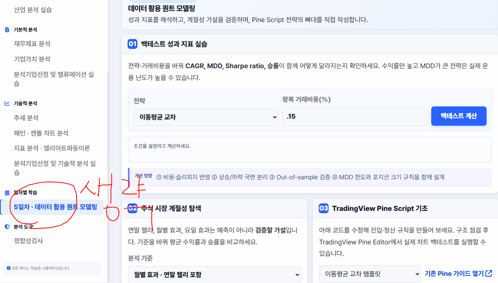
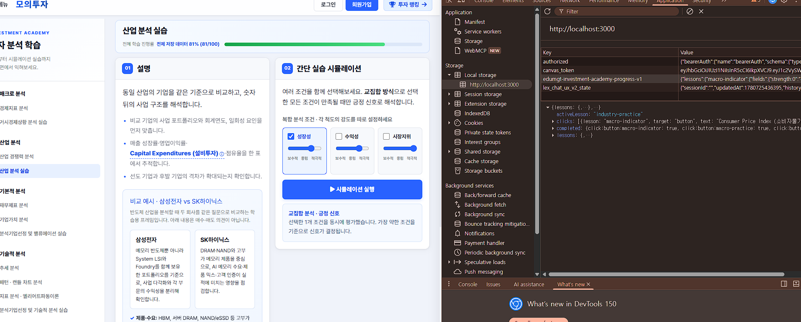

# Qunat 관련 과정

## WSL, VSCode, Git, GitHub, Docker 기본 사용 

## 투자분석 기초 방법론	
- 매크로 분석: 경제지표 분석(금리, 물가, 유가 등 주요 지표 보는 법 ), 거시경제상황 분석 실습 
- 산업 분석: 산업 경쟁력 분석(산업경쟁력 개념/분석모형, 산업별 분석방법), 산업 분석 실습 
- 기본적 분석: 재무제표분석 (손익계산서/대차대조표/현금흐름표), 기업가치분석(상대가치평가 밸류에이션(멀티플), 절대가치평가 밸류에이션 (DCF, EVA, FCF 등)), 분석기업선정 및 밸류에이션 실습 
- 기술적 분석: 추세 분석(지지선과 저항선, 이동평균선, 갭 반전, 되돌림 분석 등), 패턴 분석, 캔들 차트 분석, 지표 분석, 앨리어트파동이론, 분석기업선정 및 기술적 분석 실습	
> 80 시간

## 퀀트를 위한 금융 필수 지식	
- 금융상품 이해: 주식/ETF 상품(주식/ETF 개요 및 운용 전략), 채권 상품(채권 개요 및 운용 전략), 파생상품(파생상품 개요 및 운용 전략) 
- 자산배분방법론: 포트폴리오 이론(개요 및 성과분석, 리스크 지표), 자산배분 모델(평균분산, 블랙리터만, Risk-Parity 모델 설명), 사례 분석 실습
> 40 시간

## 데이터 활용 퀀트 모델링	
- 백테스트로 나오는 성과 지표 분석(MDD, Sharp ratio 등) 및 개선방향 논의 
- 주식 시장의 계절성 분석(연말 랠리, 월별 효과, 요일 효과) 
- 알고리즘 트레이딩 &amp; 자동매매 기초(트레이딩뷰 PineScript)	
> 40 시간

## 나만의 로보 어드바이저 개발 및 성과 검증 프로젝트	
- AI 기반의 자동화 로보 어드바이저 모델 개발 
- 패턴 인식 기법을 활용한 주식 시장 예측 프로젝트 
- 자산배분모델을 활용한 포트폴리오 최적화, 주식 스크리닝을 통한 종목 선정 등 직접 수행 
- 구축한 퀀트 모델의 결과를 해석해보고 자체적으로 모의 투자 의사결정 진행	
> 100 시간

## 나만의 투자 인디케이터 개발 및 성과 검증 프로젝트	
- 기본적인 인디케이터(MA, RSI등)로 전략 설계 
- 커스텀 인디케이터 개발 
- 트레이딩뷰 플랫폼으로 성과 확인 및 코딩 실습(PineScript) 
- 파이썬 프로그래밍을 통한 성과 검증 
- 증권사 연동(API 활용)을 통한 자동화 모델 구현	
> 120 시간


---


# 주식 투자 기초 학습 웹앱

로컬 PC에서 실행하는 학습용 웹앱입니다. 가장 간단한 방법은 Docker Compose를 사용하는 것입니다.

## 기술 스택

### 백엔드
- **FastAPI + Uvicorn** (Python) — REST API 서버
- **MongoDB** (motor/pymongo) — 퀴즈 문제·진행 상태 저장. 퀴즈 원본은 `app/backend/quiz_seed.sql`(SQLite 형식)이며, 서버 시작 시 이 파일 기준으로 MongoDB에 동기화합니다.
- **Qdrant** — 문서 검색(RAG)용 벡터 데이터베이스. `docs/*.md`를 제목 단위로 나눈 뒤 슬라이딩 윈도우로 청크화해 색인합니다.
- **Meilisearch** — 상단 검색창에서 쓰는 전체 문서 키워드 검색(RAG와 별개 색인).
- **Ollama** — 로컬 LLM(`qwen3:8b` 등)과 임베딩 모델(`embeddinggemma`)을 OpenAI 호환 API로 연동합니다. Ollama가 없는 환경(AWS 등)에서는 `RAG_EMBEDDING_PROVIDER=hash`로 해시 기반 임베딩에 자동 폴백합니다.
- **데이터·분석**: numpy, pandas, scikit-learn, scipy, matplotlib, yfinance, pykrx, openpyxl
- **딥러닝·이미지 생성 실습**: torch, diffusers(텍스트→이미지), opencv-python
- **외부 연동(선택 사항, 키 없으면 해당 기능만 비활성화)**: OpenDART(기업 재무·공시 조회), AWS Lex V2(우측 AI 투자 도우미 챗봇), boto3/AWS S3

### 프론트엔드
- 별도 번들러·프레임워크 없는 순수 JavaScript(ES 모듈) SPA — React·Vue 등을 쓰지 않습니다.
- 대부분의 차트는 Canvas 2D API로 직접 그리며, 일부 화면은 ApexCharts(CDN)를 사용합니다.
- 학습 문서(Markdown)는 marked.js(CDN)로 렌더링하고, 다이어그램은 Mermaid로 렌더링합니다.
- Font Awesome 아이콘, Pretendard/Noto Sans KR 폰트를 사용합니다.

### 인프라·배포
- **Docker Compose**로 로컬에서 앱·MongoDB·Qdrant·Ollama·Meilisearch 전체 스택을 실행합니다.
- **AWS 운영 환경**은 별도 `docker-compose.prod.yml`을 사용하며 Ollama 없이 해시 임베딩으로 동작합니다.
- **QuantConnect LEAN** 기반 백테스트(삼성전자·삼성전기 매수·보유, 현대차 이동평균 추세추종)는 앱과 독립된 별도 Compose 구성(`docker-compose.lean.yml`, `docker-compose.hd.yaml`)으로 실행하며, 결과는 `lean-results/`·`samsung-em-results/`·`hyundai-results/`에 저장되어 앱의 Quant 메뉴에서 조회합니다.

## NotebookLM - https://notebook.google.com/notebook/42560d11-3e03-4b66-890d-67d52d52ccca

## 1. Docker로 실행하기 (권장)

### 준비물

- Docker Desktop(Windows·macOS) 또는 Docker Engine + Docker Compose 플러그인(Linux)
- 사용 가능한 포트: `8000`, `27017`, `6333`, `6334`

저장소 최상위 폴더에서 실행합니다.

```bash
# 최초 실행: 앱·MongoDB·Qdrant·Ollama를 시작하고 퀴즈 데이터를 적재합니다.
docker compose --profile init up --build -d

# 최초 한 번: 로컬 답변 모델과 임베딩 모델을 받습니다.
docker compose --profile ollama-init run --rm ollama-init

# 모델을 받은 뒤 문서를 Ollama 임베딩으로 색인합니다.
docker compose --profile tools run --rm docs-index

# 이후 실행
docker compose up -d
```

브라우저에서 <http://localhost:8000>을 엽니다.

정상 실행 여부는 다음 주소에서 확인합니다.

```text
http://localhost:8000/api/health
```

## 삼성전자 LEAN 백테스트 (별도 Compose 구성)

웹앱과 독립적으로 QuantConnect LEAN 기반 삼성전자(`005930.KS`) 일봉 예제를
실행할 수 있습니다. 실행 이미지에는 전략 모듈이 포함되며, 컨테이너가 시작할 때
공개 가격 데이터를 받은 뒤 한 번의 백테스트를 수행합니다.

```bash
docker compose -f docker-compose.lean.yml run --rm samsung-backtest
```

결과 파일과 `orders.csv`는 `lean-results/`에 생성됩니다. 기본 기간은 2024년이며,
다른 기간을 지정하려면 다음처럼 실행합니다.

```bash
SAMSUNG_START_DATE=2023-01-01 SAMSUNG_END_DATE=2024-01-01 \
  docker compose -f docker-compose.lean.yml run --rm samsung-backtest
```

실행이 끝나면 `lean-results/samsung-report.html`에서 종가·포트폴리오 자산 추이,
월별 등락률, 체결 내역, LEAN 엔진 통계를 정리한 리포트를 확인할 수 있습니다
(현대차 리포트와 같은 형식).

전략과 Dockerfile은 [lean-samsung/](lean-samsung/)에 있습니다. 이 구성은 Custom
Data 기반의 동작 예제이므로 KRX 수수료·배당·거래일·환율 모델을 포함하지 않습니다.

## 삼성전기 LEAN 백테스트 (별도 Compose 구성)

웹앱과 독립적으로 QuantConnect LEAN 기반 삼성전기(`009150.KS`) 일봉 예제를
실행할 수 있습니다. 실행 이미지에는 전략 모듈이 포함되며, 컨테이너가 시작할 때
공개 가격 데이터를 받은 뒤 한 번의 백테스트를 수행합니다.

```bash
docker compose -f docker-compose.lean.yml run --rm samsung-em-backtest
```

결과 파일과 `orders.csv`는 `samsung-em-results/`에 생성됩니다. 기본 기간은
2024년이며, 다른 기간을 지정하려면 다음처럼 실행합니다.

```bash
SAMSUNG_EM_START_DATE=2023-01-01 SAMSUNG_EM_END_DATE=2024-01-01 \
  docker compose -f docker-compose.lean.yml run --rm samsung-em-backtest
```

전략과 Dockerfile은 [lean-samsung-electro-mechanics/](lean-samsung-electro-mechanics/)에
있습니다. 이 구성은 삼성전자 모듈과 동일한 방식의 Custom Data 기반 동작 예제이므로
KRX 수수료·배당·거래일·환율 모델을 포함하지 않습니다.

## 현대자동차 LEAN 추세 신호 검증 (별도 Compose 구성)

현대자동차 보통주(`005380.KS`)의 Yahoo Finance 일봉 Custom Data로 2026년 상반기
추세 신호를 검증할 수 있습니다. 2022~2025년 데이터로 이동평균을 준비한 뒤,
`SMA20 > SMA60`일 때 롱 신호를 내고 그 외에는 현금 보유하는 전략입니다.

```bash
docker compose -f docker-compose.hd.yaml run --build --rm hyundai-backtest
```

기본 데이터 기간은 2022-01-01부터 2026-06-30까지이며, 검증 기간은 2026년
상반기입니다. 다른 기간을 지정하려면 다음 환경 변수를 설정합니다.

```bash
HYUNDAI_DATA_START_DATE=2022-01-01 HYUNDAI_DATA_END_DATE=2026-07-01 \
HYUNDAI_TEST_START_DATE=2026-01-01 HYUNDAI_TEST_END_DATE=2026-07-01 \
  docker compose -f docker-compose.hd.yaml run --build --rm hyundai-backtest
```

실행 결과는 `hyundai-results/`에 저장되며,
`hyundai-2026-h1-report.html`에서 월별 다음 거래일 방향 적중률, 신호 전략과
단순 보유의 누적 수익률, 주문 수·순수익·낙폭·Sharpe Ratio를 확인할 수 있습니다.
전략과 상세 사용법은 [lean-hyundai/](lean-hyundai/)에서 확인하세요. 이 검증은
과거 가격 기반 신호 예제이며 KRX 수수료·세금·배당·액면분할·환율은 반영하지 않습니다.

### 포트 또는 API 키 설정

이미 같은 포트를 사용 중이면 저장소 루트에 `.env` 파일을 만들고 값을 바꿉니다.

```dotenv
APP_PORT=8080
MONGO_PORT=27018
QDRANT_PORT=6335
QDRANT_GRPC_PORT=6336

# 선택 사항: 공시·통계 API 기능
DART_API_KEY=
```

`APP_PORT`를 바꿨다면 접속 주소도 예를 들어 <http://localhost:8080>으로 바뀝니다.

### 문서 검색 색인 만들기

`docs/`의 Markdown 문서를 바꾼 뒤에는 아래 명령으로 Qdrant 검색 색인을 다시 만듭니다.

```bash
docker compose --profile tools run --rm docs-index
```

문서 검색은 Ollama의 `embeddinggemma`로 문서와 질문을 같은 벡터 공간에 임베딩하고,
선택 시 로컬 Ollama 채팅 모델이 검색 원문만 근거로 답변을 생성합니다. 기본 모델은
`embeddinggemma`(임베딩)와 `qwen3:8b`(답변)이며, 저장소 루트 `.env`에서
`RAG_EMBEDDING_MODEL`, `RAG_LLM_MODEL`로 바꿀 수 있습니다. 모델을 바꿨다면 반드시
문서 색인을 다시 만드세요.

`docker-compose.prod.yml`은 AWS용 구성으로 Ollama를 포함하지 않습니다. 이 구성에서는
`RAG_EMBEDDING_PROVIDER=hash`로 동작하므로, AWS에서 Ollama 이미지·모델·포트를 설치하거나
노출하지 않습니다. AWS용 문서 색인은 `RAG_EMBEDDING_PROVIDER=hash`로 다시 만들어야 하며,
화면의 로컬 AI 답변 생성 선택지는 비활성화됩니다.

### 상태 확인·종료

```bash
# 컨테이너 상태
docker compose ps

# 앱 로그
docker compose logs -f backend

# 컨테이너 종료 (데이터는 유지)
docker compose down
```

아래 명령은 MongoDB 퀴즈 데이터와 Qdrant 검색 색인까지 삭제합니다.

```bash
docker compose down -v
```

## 2. Python으로 직접 실행하기

Docker를 쓰지 않는 경우에는 Python과 MongoDB를 직접 준비합니다.

### 준비물

- Python 3.12 이상
- MongoDB (퀴즈 기능 사용 시)
- `mongosh` (아래 퀴즈 초기화 스크립트 사용 시)

```bash
python3 -m venv .venv
source .venv/bin/activate
pip install -r requirements.txt
```

### 로컬 환경변수 설정

백엔드는 실행할 때 `app/backend/.env`를 읽습니다. 먼저 저장소에 포함된 예시 파일을
복사해 개인별 설정 파일을 만드세요. `.env`는 API 키처럼 민감한 값을 담을 수 있으므로
Git에 추가하지 않습니다.

macOS·Linux에서는 다음을 실행합니다.

```bash
cp app/backend/.env.example app/backend/.env
```

Windows PowerShell에서는 다음 명령을 사용합니다.

```powershell
Copy-Item app/backend/.env.example app/backend/.env
```

복사한 `app/backend/.env`를 열어 필요한 값만 수정합니다.

```dotenv
# 퀴즈 기능용 MongoDB. 로컬 기본 설치를 사용하면 그대로 둡니다.
MONGODB_URL=mongodb://localhost:27017
MONGODB_DB=investment_db

# 문서 검색(RAG)용 Qdrant. 검색 기능을 쓰지 않으면 Qdrant가 없어도 앱의 다른 기능은 실행됩니다.
QDRANT_URL=http://localhost:6333
QDRANT_COLLECTION=investment_docs

# 로컬 Ollama 기반 전체 RAG. 색인과 질의에 같은 임베딩 모델을 사용합니다.
RAG_EMBEDDING_PROVIDER=ollama
RAG_EMBEDDING_URL=http://localhost:11434/api/embed
RAG_EMBEDDING_MODEL=embeddinggemma
RAG_LLM_BASE_URL=http://localhost:11434/v1
RAG_LLM_API_KEY=ollama
RAG_LLM_MODEL=qwen3:8b
RAG_LLM_TIMEOUT_SECONDS=180

# 선택 사항: 우측 AI 투자 도우미를 Amazon Lex V2에 연결합니다.
# 장기 자격 증명 대신 EC2/ECS 등의 IAM 역할 사용을 권장합니다.
# AWS_REGION=ap-northeast-2
# LEX_BOT_ID=
# LEX_BOT_ALIAS_ID=
# LEX_LOCALE_ID=ko_KR

# OpenDART 기업 검색·재무 분석 기능을 사용할 때만 발급받은 인증키를 입력합니다.
# 비워 두면 DART 관련 API는 503 응답을 반환합니다.
DART_API_KEY=

# 선택 사항: GPU 환경에서 텍스트-이미지 생성에 다른 Diffusers 모델을 쓸 때만 설정합니다.
# DIFFUSERS_MODEL_ID=runwayml/stable-diffusion-v1-5
```

Lex 봇은 배포한 버전의 별칭을 사용하세요. 애플리케이션을 실행하는 EC2/ECS 역할에는 해당 별칭 ARN(`arn:aws:lex:<리전>:<계정>:bot-alias/<봇ID>/<별칭ID>`)에 대한 `lex:RecognizeText` 권한만 부여하면 됩니다. 브라우저나 저장소에 AWS 액세스 키를 넣지 마세요.

설정 항목은 다음과 같습니다.

| 변수 | 필요한 기능 | 설명 |
| --- | --- | --- |
| `MONGODB_URL` | 퀴즈 | MongoDB 접속 주소입니다. MongoDB를 쓰지 않는 화면은 이 값 없이도 열 수 있지만, 퀴즈 조회·저장은 동작하지 않습니다. |
| `MONGODB_DB` | 퀴즈 | 사용할 데이터베이스 이름입니다. 로컬 기본값은 `investment_db`입니다. |
| `QDRANT_URL` | 문서 검색 | Qdrant HTTP 주소입니다. Qdrant가 실행되지 않으면 RAG 검색 API는 `503`을 반환합니다. |
| `QDRANT_COLLECTION` | 문서 검색 | 색인할 Qdrant 컬렉션 이름입니다. 색인 명령과 같은 값으로 유지하세요. |
| `RAG_EMBEDDING_PROVIDER` | 문서 검색 | 로컬은 `ollama`, Ollama를 설치하지 않는 AWS 구성은 `hash`를 사용합니다. 두 방식의 색인은 서로 호환되지 않습니다. |
| `RAG_EMBEDDING_URL` | 문서 검색 | Ollama의 `/api/embed` 주소입니다. 색인과 질의가 같은 주소·모델을 사용해야 합니다. |
| `RAG_EMBEDDING_MODEL` | 문서 검색 | 문서·질문을 벡터화할 Ollama 임베딩 모델입니다. 모델을 바꾸면 색인을 다시 만듭니다. |
| `RAG_LLM_BASE_URL` | 문서 검색 답변 생성 | Ollama OpenAI 호환 API의 기본 주소입니다. 기본값은 `http://localhost:11434/v1`입니다. |
| `RAG_LLM_API_KEY` | 문서 검색 답변 생성 | Ollama 로컬 API에서는 무시되지만, 앱의 OpenAI 호환 호출을 위해 비어 있지 않은 값을 사용합니다. |
| `RAG_LLM_MODEL` | 문서 검색 답변 생성 | 검색 원문만 바탕으로 답변을 만들 Ollama 채팅 모델입니다. |
| `RAG_LLM_TIMEOUT_SECONDS` | 문서 검색 답변 생성 | 로컬 모델 응답을 기다리는 최대 시간(초)입니다. CPU 환경에서는 첫 요청이 느릴 수 있습니다. |
| `AWS_REGION` | AI 투자 도우미 | Amazon Lex V2 봇이 배포된 AWS 리전입니다. |
| `LEX_BOT_ID` | AI 투자 도우미 | Amazon Lex V2 봇 ID입니다. |
| `LEX_BOT_ALIAS_ID` | AI 투자 도우미 | 배포한 Amazon Lex V2 별칭 ID입니다. |
| `LEX_LOCALE_ID` | AI 투자 도우미 | Lex 로캘입니다. 기본값은 `ko_KR`입니다. |
| `DART_API_KEY` | 기업·공시 분석 | OpenDART 인증키입니다. 키를 공개 저장소나 화면 캡처에 포함하지 마세요. |
| `DIFFUSERS_MODEL_ID` | 텍스트-이미지 생성 | 선택 설정입니다. 기본 모델을 바꾸려는 GPU 환경에서만 사용합니다. |

MongoDB·Qdrant·Ollama를 모두 로컬에 설치하지 않았다면, Docker Compose로 세 서비스를 실행한 뒤
Python 백엔드를 직접 실행할 수도 있습니다.

```bash
docker compose up -d mongo qdrant ollama
docker compose --profile ollama-init run --rm ollama-init
```

문서 검색을 처음 사용하거나 `docs/`의 Markdown을 변경한 뒤에는 Qdrant에 문서를 색인합니다.

```bash
QDRANT_URL=http://localhost:6333 \
QDRANT_COLLECTION=investment_docs \
RAG_EMBEDDING_PROVIDER=ollama \
RAG_EMBEDDING_URL=http://localhost:11434/api/embed \
RAG_EMBEDDING_MODEL=embeddinggemma \
./scripts/upload_docs_to_qdrant.sh
```

앱을 시작합니다.

```bash
uvicorn app.backend.main:app --host 0.0.0.0 --port 8000
```

브라우저에서 <http://localhost:8000>을 열고, API 명세와 요청 예시는
<http://localhost:8000/docs>에서 확인할 수 있습니다. 다음 명령으로도 서버 상태를 확인합니다.

```bash
curl http://localhost:8000/api/health
```

퀴즈 데이터를 MongoDB에 넣으려면 별도 터미널에서 실행합니다.

```bash
./scripts/init_quiz_mongodb.sh --replace
```

`--replace`는 기존 퀴즈 문항을 삭제하고 현재 시드 문항으로 교체합니다.

## 문서 메뉴 갱신

학습 문서의 제목이나 파일을 수정했다면 다음 명령을 실행합니다.

```bash
python3 scripts/sync_learning_menu.py
```

## 문제 해결

- 페이지에 접속할 수 없으면 `docker compose ps` 또는 터미널의 Uvicorn 로그를 확인하세요.
- 퀴즈가 저장되지 않으면 MongoDB가 실행 중인지와 `MONGODB_URL`을 확인하세요.
- 문서 검색이 비어 있으면 Qdrant가 실행 중인지 확인한 뒤 `docs-index`를 다시 실행하세요.
- `DART_API_KEY` 등 선택 API 키가 비어 있으면 해당 외부 데이터 기능이 제한될 수 있습니다.


## 본 7차 과정의 시험 방식 - 실습 40% 반영
### 다음의 실습을 https://st.edumgt.co.kr/analysis.html 사이트를 통해 진행 합니다.(국비과정에 명기된 내용)
- 매크로 분석: 경제지표 분석(금리, 물가, 유가 등 주요 지표 보는 법 ), 거시경제상황 분석 실습 
- 산업 분석: 산업 경쟁력 분석(산업경쟁력 개념/분석모형, 산업별 분석방법), 산업 분석 실습 
- 기본적 분석: 재무제표분석 (손익계산서/대차대조표/현금흐름표), 기업가치분석(상대가치평가 밸류에이션(멀티플), 절대가치평가 밸류에이션 (DCF, EVA, FCF 등)), 분석기업선정 및 밸류에이션 실습 
- 기술적 분석: 추세 분석(지지선과 저항선, 이동평균선, 갭 반전, 되돌림 분석 등), 패턴 분석, 캔들 차트 분석, 지표 분석, 앨리어트파동이론, 분석기업선정 및 기술적 분석 실습

## 아래 파트는 생략해주세요


### 결과물은 모두에게 공유되어 공정하게 확인 되도록 각자 작업 내용을 json 포맷으로 남겨 디스코드에 공유 합니다.


### 위와 같이 전체적으로 클릭, 입력 이벤트의 작업에 대해 Applicaion - localstorage 에 데이타가 생성되며 80%가 넘은
### 해당 데이타 셋을 copy object 로 메모장에 복사. 압축하여 디스코드에 성명1.zip 으로 업로드 합니다.

## 개발환경 구축 테스트 - 30% 반영
### https://github.com/edumgt/investment-analysis repo 에 대해 각 수강생별 본인 PC 환경의 Docker 에서
### 실행 퀴즈 - 단어장 30문제에 대해 퀴즈 본 후 해당 결과를 mongodb 에서 데이타 추출( 이 모든 과정은 AI 의 도움을 받아 처리합니다.) 후 위와 같은 방법으로 성명2.zip 으로 업로드 합니다.

## DockerHUB 에 최종 본 공유 - 30% 반영

## Git 명령어 일람

이 문서는 이 프로젝트에서 자주 쓰는 Git 명령을 빠르게 찾아볼 수 있도록 정리한 참고 자료입니다. 명령은 저장소 루트에서 실행하는 것을 기준으로 합니다.

### 1. 현재 상태 확인

```bash
git status                 # 수정·스테이징·추적되지 않은 파일 확인
git status --short         # 상태를 짧은 형식으로 확인
git log --oneline -20      # 최근 20개 커밋을 한 줄씩 확인
git log --graph --oneline --all  # 브랜치 구조를 포함한 이력 확인
git diff                   # 아직 스테이징하지 않은 변경 내용 확인
git diff --staged          # 스테이징한 변경 내용 확인
git show <커밋해시>         # 특정 커밋의 상세 변경 확인
```

### 2. 변경사항 기록하기

```bash
git add <파일경로>          # 파일 하나를 스테이징
git add .                  # 현재 경로 아래의 변경사항을 스테이징
git restore --staged <파일경로>  # 스테이징만 취소하고 파일 수정은 유지
git commit -m "feat: 기능 설명"  # 커밋 생성
git commit --amend          # 직전 커밋 메시지 또는 내용을 수정
```

커밋 전에 `git diff --staged`로 포함될 내용을 확인하는 습관이 좋습니다. 이미 원격에 공유한 커밋은 `--amend`보다 새 커밋으로 수정하는 편이 안전합니다.

### 3. 원격 저장소와 동기화

```bash
git remote -v              # 등록된 원격 저장소 확인
git fetch origin           # 원격 이력만 가져오기 (로컬 브랜치는 변경하지 않음)
git pull                   # 원격 변경을 가져와 현재 브랜치에 반영
git push origin main       # 로컬 main의 새 커밋을 원격 main으로 전송
```

`git pull` 시 기본 병합 방식을 merge로 지정하려면 다음을 사용합니다.

```bash
git config pull.rebase false          # 현재 저장소에만 적용
git config --global pull.rebase false # 모든 저장소에 적용
```

### 4. 브랜치 작업

```bash
git branch                 # 로컬 브랜치 목록 확인
git switch -c <브랜치명>   # 새 브랜치를 만들고 이동
git switch <브랜치명>      # 기존 브랜치로 이동
git branch -d <브랜치명>   # 병합된 로컬 브랜치 삭제
git merge <브랜치명>       # 현재 브랜치에 대상 브랜치 병합
```

### 5. 변경 취소와 복구

```bash
git restore <파일경로>     # 작업 파일을 마지막 커밋 상태로 되돌림
git restore --staged <파일경로>  # 스테이징 취소
git revert <커밋해시>      # 기존 이력을 보존하며 반대 변경을 새 커밋으로 기록
git reflog                 # HEAD 이동 이력 확인; reset 뒤 복구할 때 유용
```

`git restore <파일경로>`는 해당 파일의 저장하지 않은 수정을 잃게 합니다. 먼저 `git diff`로 확인하세요.

### 6. 최근 커밋 제거 (주의)

아래 명령은 현재 브랜치의 최근 커밋과 그 파일 변경을 함께 제거합니다.

```bash
git log --oneline -31      # 제거 범위와 남길 기준 커밋을 먼저 확인
git reset --hard HEAD~<개수>
```

예를 들어 최근 30개 커밋을 제거하려면 다음과 같습니다.

```bash
git reset --hard HEAD~30
```

이 명령은 아직 커밋하지 않은 변경도 제거하므로, 실행 전 `git status`가 깨끗한지 확인해야 합니다. 원격에 이미 올린 이력을 바꿨다면 원격 반영에는 다음이 필요합니다.

```bash
git push --force-with-lease origin main
```

`--force-with-lease`는 다른 사람이 새로 올린 원격 커밋이 있는 경우 푸시를 막아 주므로, 일반적인 강제 푸시보다 안전합니다. 공동 작업 브랜치에서는 가능한 한 `git revert`를 우선 사용하세요.

### 7. 충돌 해결

```bash
git status                 # 충돌 난 파일 확인
# 충돌 표시(<<<<<<, ======, >>>>>>)를 직접 수정
git add <해결한파일>        # 해결 완료 표시
git commit                 # merge 충돌 해결 후 병합 커밋 생성
```

rebase 중 충돌이 났다면 `git add <파일>` 후 `git rebase --continue`를 실행합니다. 작업을 취소하려면 `git merge --abort` 또는 `git rebase --abort`를 사용합니다.

### 8. 추천 기본 흐름

```bash
git status
git pull
git add <파일경로>
git diff --staged
git commit -m "feat: 변경 내용"
git push origin main
```

공유 브랜치에서는 변경 전 상태 확인 → 작은 단위 커밋 → 원격 동기화 순서를 지키면 충돌과 이력 손실을 줄일 수 있습니다.
